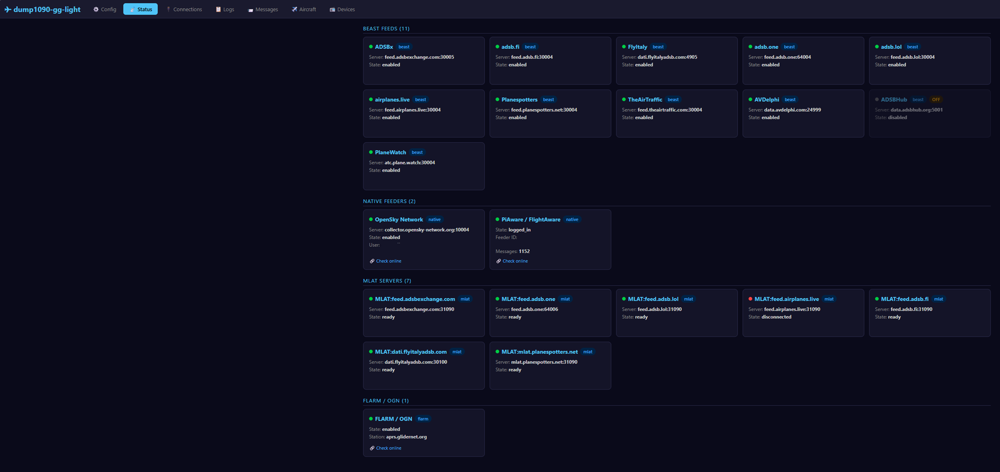
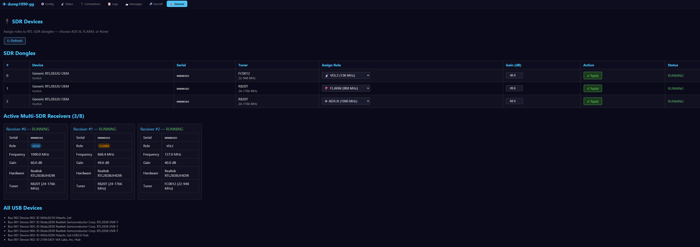
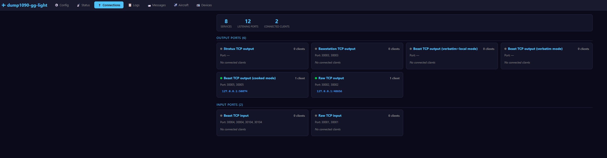
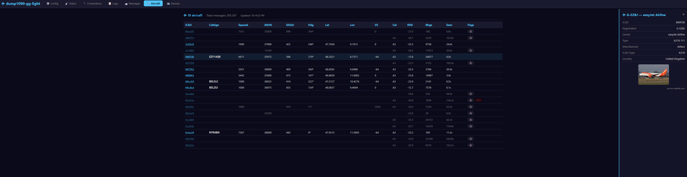
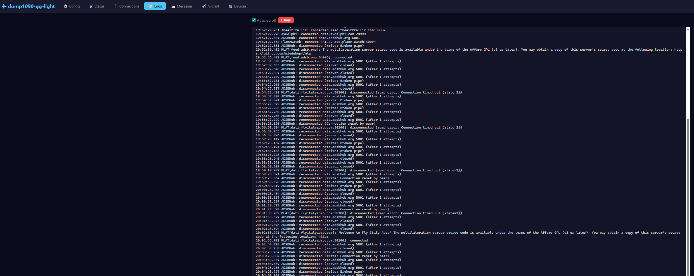

# dump1090-gg-light

**dump1090-gg-light** is an all-in-one ADS-B / Mode S / FLARM / OGNTP / ADS-L /
P3I / FANET+ / ACARS / VDL2 / Radiosonde / CPDLC / COSPAS-SARSAT / GSM / LTE /
POCSAG / IoT 868 MHz receiver and multi-feed relay for Linux.
It is a fork of [dump1090-fa](https://github.com/flightaware/dump1090) by FlightAware,
extended with native threaded feeder clients, a multi-SDR receiver architecture
with pluggable backends (librtlsdr and libsdrgg), a C++17 message dispatcher,
decoders for aeronautical communication and surveillance, weather sounding,
emergency beacons, cellular/paging/IoT signals, and a built-in web control
panel with version display.

Fork maintainer and project direction: **Luigi Origa**.

This is the **light version** for public distribution. The proprietary feeder
protocols (Flightradar24, PlaneFinder, RadarBox) have been replaced with inert
compatibility stubs (the source files still exist so that legacy CLI options
do not break the build, but they contain no functional code) because their
terms of service regarding third-party client implementations are ambiguous or
unclear — to avoid any potential legal issues, the working implementations are
not included. All open-source feeders and 11 Beast-binary tracking networks are
fully functional.

Public tree note: this repository is in the middle of a staged C-to-C++
migration. The documentation below refers to stable module names and public
features; some implementation files are still `.c`, some are already `.cpp`,
and older history sections may retain the filenames that were current when
those notes were written. Internal one-off validation tools used during
development are not part of the public tree unless the files are present here.

## About this project — AI as a developer

This project is an **experiment to test the effectiveness of AI as a software
developer**. The repository contains substantial upstream code from **dump1090-fa**
and its predecessors (by Oliver Jowett / FlightAware), which retains its original
authorship and copyright. Large portions of the upstream code remain intact,
but this fork also extends several upstream files with new options, feeder
integration, decoder hooks, panel endpoints, and build changes. All of the
**new functionality** — the native feeder
clients, multi-SDR architecture, FLARM / OGNTP / ADS-L / P3I / FANET+ /
ACARS / VDL2 / Radiosonde / CPDLC / COSPAS-SARSAT / GSM / LTE / POCSAG / IoT
decoders, the airframes.io feed, the C++17 message dispatcher, the web control
panel, Makefile modifications, protocol implementations, the information
gathering, and this README itself — was
**written entirely by AI**,
under the **continuous supervision of a human** who directed what to do, how to do
it, which design decisions to make, and which approaches to take.

That human operator and maintainer of this fork is **Luigi Origa**.

**This is not "vibe coding".** The human operator is an **IT security
specialist** with deep software development expertise. Every design choice, protocol behavior, and implementation
detail was verified against that hands-on technical knowledge — the AI was
used as a precision tool to write code faster, not as a substitute for
engineering judgment.

The human operator provided:
- The overall architecture and all major design decisions
- Specific technical directions and implementation strategies
- Debugging decisions and root-cause analysis guidance
- Code review and validation of every change before deployment
- Continuous oversight — the AI's output had to be checked constantly,
  because it would silently change architecture or approach without warning
- Simpler, more logical solutions when the AI over-complicated things —
  in many cases the human had to suggest the straightforward approach
  that the AI failed to see on its own
- Firm direction when the AI drifted — at times the AI had to be explicitly
  forced to follow the given directives instead of inventing its own plan

The AI performed:
- All code writing (C, C++, Python helper scripts, Makefile edits)
- Protocol research and information gathering from open-source references
- File transfers, remote compilation, and deployment to the target device
- Diagnostic reading of logs, journal output
- Writing this documentation

### Conclusion

**AI is an excellent tool for writing and modifying code quickly** — it can
produce working C implementations of complex protocols, handle build systems,
diagnose compiler errors, and iterate rapidly. However, **AI is not capable of
making correct autonomous decisions**. Without human direction, it tends to:
- Over-engineer solutions or add unnecessary abstractions
- Make wrong assumptions about protocol behavior
- Miss subtle issues
- Fail to prioritize or choose the right approach among alternatives
- **Get the simplest architectures wrong** — even straightforward designs
  that any developer would get right on the first try
- **Silently change architecture** without notice or justification, requiring
  the human to catch the deviation and force a rollback

The human-AI collaboration model — where the human makes architectural and
strategic decisions while the AI handles the mechanical work of writing,
compiling, and deploying code — proved highly effective for this project.

---

## What's different from dump1090-fa

| Feature | dump1090-fa (upstream) | dump1090-gg-light |
|---|---|---|
| ADS-B decoding | ✅ | ✅ (enhanced Comm-B/TIS-B/ELM/CPDLC) |
| BDS 4,4 / 4,5 meteorological | not decoded | **native** (MRAR: wind/temp/pressure; MHAR: turbulence/icing/windshear) |
| BeastReduce rate limiting | not supported | **native** (per-aircraft 250 ms throttle for all beast feeds) |
| PiAware / FlightAware feed | external `piaware` + `faup1090` | **native thread** (TLS, ADEPT protocol) |
| FlightAware MLAT | external `fa-mlat-client` (Python) | **native thread** (UDP binary protocol) |
| ADSBexchange MLAT | external `mlat-client` (Python) | **native thread** (JSON-over-TCP) |
| OpenSky Network feed | external daemon | **native thread** (binary protocol) |
| Beast feeds (11 networks) | not supported | **native thread** (ADSBx, adsb.fi, FlyItaly, adsb.one, adsb.lol, airplanes.live, Planespotters, TheAirTraffic, AVDelphi, PlaneWatch, ADSBHub) |
| SondeHub upload | not supported | **native thread** (HTTPS PUT to SondeHub v2 API) |
| FLARM / OGNTP / OGN feed | not supported | **native** (2nd RTL-SDR, GFSK demod, LDPC, OGN APRS-IS) |
| ADS-L (EASA EC) | not supported | **native** (868 MHz, XXTEA, Mode-S CRC-24) |
| PilotAware P3I | not supported | **native** (869.5 MHz, 2-FSK 38.4 kbps) |
| FANET+ LoRa | not supported | **native** (868.2 MHz, LoRa CSS SF7 BW250k) |
| ACARS decoding | not supported | **native** (AM envelope + MSK demod, 5 channels) |
| VDL2 decoding | not supported | **native** (D8PSK demod, AVLC parsing, ACARS extraction) |
| Airframes.io feed | not supported | **native** (UDP JSON for ACARS + VDL2 to airframes.io) |
| Radiosonde decoding | not supported | **native** (RS41/RS92/DFM/M10, RS ECC, GPS, PTU) |
| CPDLC decoding | not supported | **native** (FANS-1/A ASN.1 UPER via ELM) |
| ELM reassembly (DF24–31) | not supported | **native** (ACARS/CPDLC extraction from Comm-D) |
| COSPAS-SARSAT 406 MHz | not supported | **native** (ELT/EPIRB/PLB beacon decoder, BCH FEC) |
| GSM cell scanning | not supported | **native** (GMSK demod, FCCH/SCH sync, SI decode, cell tracking) |
| POCSAG pager decoding | not supported | **native** (FSK demod, BCH ECC, alpha/numeric, multi-baud) |
| IoT 868 MHz | not supported | **native** (OOK/FSK: Bresser, LaCrosse, Honeywell, wMBus C/T) |
| Multi-SDR management | single dongle | **dynamic role assignment** (up to 8 RTL-SDR, 11 roles) |
| SDR backend | librtlsdr only | **pluggable** (librtlsdr + libsdrgg optimized USB driver) |
| Web control panel | not supported | **native** (HTTP REST API, live configuration) |
| Waterfall / spectrum analyzer | not supported | **native** (real-time FFT, WebSocket stream, frequency tuning) |
| Statistics dashboard | not supported | **native** (Chart.js time-series, persistent history, per-decoder counters) |
| System warnings | not supported | **native** (DVB driver conflict detection, popup alerts) |

All feeder threads use **lock-free SPSC ring buffers** to receive data from the main
decode loop, so slow or failing network I/O on any single feed cannot block decoding.



### Architecture overview

```
RTL-SDR #1 (1090 MHz) ──► ADS-B decode ──┬──► PiAware thread   → piaware.flightaware.com:1200 (TLS)
                           DF24 → ELM    │    FA-MLAT thread   → FlightAware MLAT server (UDP)
                           ELM → CPDLC   │    ADSBx MLAT       → mlat.adsbexchange.com (JSON-TCP)
                                          ├──► OpenSky thread   → collector.opensky-network.org:10004
                                          ├──► Beast feed thread → 11 networks simultaneously
                                          │     ADSBx, adsb.fi, FlyItaly, PlaneWatch, adsb.one,
                                          │     adsb.lol, airplanes.live, Planespotters,
                                          │     TheAirTraffic, AVDelphi, ADSBHub
                                          └──► JSON files       → /run/dump1090-gg/

RTL-SDR #2 (868 MHz)  ──► FLARM demod ───┬──► OGN thread       → aprs.glidernet.org:14580 (APRS-IS)
                          OGNTP demod ────┤
                          ADS-L demod ────┤
                          P3I demod ──────┤
                                          └──► Synthetic DF18   → ADS-B pipeline (merged)

RTL-SDR #3 (131 MHz)  ──► ACARS demod ───┬──► Airframes feed   → feed.acars.io:5550 (UDP JSON)
                                          ├──► Message display  (5 EU channels, AM-MSK)
                                          └──► aircraft.json integration

RTL-SDR #4 (136 MHz)  ──► VDL2 demod  ───┬──► Airframes feed   → feed.acars.io:5552 (UDP JSON)
                                          ├──► Message display  (3 EU channels, D8PSK 10.5 ksym/s)
                                          └──► aircraft.json integration

RTL-SDR #5 (403 MHz)  ──► Sonde demod ───┬──► SondeHub thread  → api.v2.sondehub.org (HTTPS PUT)
                          (RS41/RS92/    │
                           DFM/M10)      └──► Message display  (FFT freq scan, RS ECC)

RTL-SDR #6 (868.2 MHz)──► FANET+ demod ──┬──► Synthetic DF18   → ADS-B pipeline (merged)
                          (LoRa CSS SF7)  └──► FANET Monitor    → /api/fanet statistics

RTL-SDR #7 (406 MHz)  ──► SARSAT demod ──┬──► Message display  (ELT/EPIRB/PLB beacons)
                          (BPSK, BCH FEC) └──► Beacon alerts    (country, position, type)

RTL-SDR #8 (935 MHz)  ──► GSM decode  ───┬──► Cell tracker     (FCCH/SCH sync, SI3 decode)
                          (GMSK 271 ksym) │    /api/gsm         (MCC/MNC/LAC/CellID/ARFCN)
                                          └──► PPM calibration  (crystal offset from carrier)

                       ──► POCSAG demod ──┬──► Message display  (512/1200/2400 baud)
                          (FSK, BCH ECC)  └──► /api/messages    (alpha + numeric pages)

                        ──► LTE decode  ───┬──► Cell scanner     (PSS/SSS, MIB, selected SIBs)
                          (OFDM, ZC seq)  └──► ETWS/CMAS alerts (earthquake/tsunami warnings)

                        ──► IoT 868 demod ─┬──► Message display  (Bresser, LaCrosse, Honeywell, wMBus)
                          (OOK/FSK)       └──► Temperature data

Web control panel (port 8888) ──► Live config, status, logs, device management
                               ──► Waterfall spectrum analyzer (WebSocket, per-device FFT)
```

---

## Building

### Prerequisites

```bash
sudo apt-get install build-essential librtlsdr-dev pkg-config libncurses5-dev \
    libbladerf-dev libhackrf-dev liblimesuite-dev libsoapysdr-dev \
    libssl-dev zlib1g-dev
```

### Compile

```bash
make clean
make -j4 DUMP1090_VERSION=custom-threads
```

`DUMP1090_VERSION` sets the version string embedded in the binary (shown in
`--help` output and the SkyAware web interface). Any value can be used; omit it
to use the Makefile default shown during the build.

Normal builds keep decoder diagnostics quiet by default. To enable the
development-oriented ACARS / VDL2 / FANET / GSM calibration / adaptive-gain
trace output, build with `make -j4 DUMP1090_DIAGNOSTICS=yes`.

This produces three binaries: `dump1090`, `view1090`, `starch-benchmark`.

#### libsdrgg support

The program supports two SDR backends:

- **librtlsdr** — the standard open-source RTL-SDR driver (default)
- **libsdrgg** — an optimized USB SDR driver designed for better control of
  RTL-SDR hardware, with per-stage gain (LNA/mixer/VGA), R820T IF frequency
  reprogramming, PLL lock detection, and improved USB transfer management

To build with libsdrgg support:

```bash
cd ../libsdrgg
make

cd ../dump1090-gg-light
make clean
make -j4 SDRGG=yes
```

If libsdrgg is installed in a non-standard location:

```bash
make -j4 SDRGG=yes SDRGG_PREFIX=/path/to/libsdrgg
```

`SDRGG_PREFIX` can point either to the libsdrgg source tree or to an installed
prefix. When a shared `libsdrgg.so` is present, the build prefers it and adds
an rpath for that location; if only `libsdrgg.a` exists, it falls back to the
static archive.

When both backends are compiled in, each receiver can select its backend via
the `backend=` option in the `--receiver` config string:

```bash
--receiver 00000001:adsb:backend=sdrgg --receiver 00000002:flarm:backend=rtlsdr
```

### Install

```bash
sudo cp dump1090 /usr/bin/dump1090-gg
sudo chmod 755 /usr/bin/dump1090-gg
```

---

## Configuration

The configuration file is `/etc/default/dump1090-gg` (shell-script fragment,
sourced by the start script). The systemd service is `dump1090-gg.service`.
Live configuration is also possible via the web control panel.

### Command-line options

#### SDR and decoding

| Option | Description |
|---|---|
| `--device-type <type>` | SDR type: `rtlsdr`, `sdrgg`, `bladerf`, `hackrf`, `limesdr`, `ifile` |
| `--gain <dB>` | Tuner gain (default: max). `-10` for AGC |
| `--freq <Hz>` | Override frequency (default: 1090 MHz) |
| `--fix` | Enable single-bit CRC error correction |
| `--enable-df24` | Enable DF24–31 Comm-D ELM decoding (required for CPDLC) |
| `--receiver <spec>` | Add SDR receiver: `serial:role[:gain=X][:ppm=Y][:agc][:backend=name]` |
| | Role: `adsb`, `flarm`, `acars`, `vdl2`, `radiosonde`, `gsm`, `pocsag`, `lte`, `iot868`, `fanet`, `sarsat` |
| | Backend: `rtlsdr` (default), `sdrgg` |

#### FLARM / OGN

| Option | Description |
|---|---|
| `--flarm` | Enable FLARM 868 MHz decoder |
| `--flarm-device <serial>` | RTL-SDR serial for 868 MHz dongle |
| `--flarm-gain <dB>` | FLARM dongle gain (0 = auto) |
| `--flarm-ppm <ppm>` | Frequency correction in PPM |
| `--flarm-keys <file>` | Load FLARM decryption keys from file |
| `--ogn-station <name>` | OGN station callsign for APRS-IS feed |
| `--ogn-server <host>` | OGN APRS-IS server (default: aprs.glidernet.org) |
| `--ogn-port <port>` | OGN APRS-IS port (default: 14580) |

#### GSM cell scanner

| Option | Description |
|---|---|
| `--gsm` | Enable GSM broadcast channel decoder |
| `--gsm-device <serial>` | RTL-SDR serial for GSM dongle |
| `--gsm-gain <dB>` | GSM dongle gain (0 = auto) |
| `--gsm-ppm <ppm>` | Frequency correction in PPM |
| `--gsm-freq <Hz>` | GSM downlink frequency (default: 947.0 MHz / ARFCN 60) |

#### POCSAG pager decoder

| Option | Description |
|---|---|
| `--pocsag` | Enable POCSAG pager decoder |
| `--pocsag-device <serial>` | RTL-SDR serial for POCSAG dongle |
| `--pocsag-gain <dB>` | POCSAG dongle gain (0 = auto) |
| `--pocsag-ppm <ppm>` | Frequency correction in PPM |
| `--pocsag-freq <Hz>` | POCSAG frequency (default: 466.075 MHz) |

#### Feeder clients

| Option | Description |
|---|---|
| `--piaware` | Enable built-in PiAware ADEPT client |
| `--piaware-feeder-id <uuid>` | FlightAware feeder ID (no external piaware needed) |
| `--opensky` | Enable OpenSky Network feed |
| `--opensky-user <name>` | OpenSky username |
| `--opensky-serial <n>` | OpenSky serial number |
| `--sondehub <callsign>` | Enable SondeHub upload with this callsign |

#### Airframes.io feed (ACARS/VDL2)

| Option | Description |
|---|---|
| `--airframes-acars` | Enable ACARS feed to airframes.io |
| `--airframes-vdl2` | Enable VDL2 feed to airframes.io |
| `--airframes-acars-host <host>` | ACARS feed host (default: feed.acars.io) |
| `--airframes-acars-port <port>` | ACARS feed port (default: 5550) |
| `--airframes-vdl2-host <host>` | VDL2 feed host (default: feed.acars.io) |
| `--airframes-vdl2-port <port>` | VDL2 feed port (default: 5552) |
| `--airframes-station-id <id>` | Station identifier for airframes.io |

#### Beast feed networks (11 supported)

Each network can be enabled individually. Host and port are overridable.

| Option | Default destination |
|---|---|
| `--adsbx` | feed.adsbexchange.com:30005 |
| `--adsbfi` | feed.adsb.fi:30004 |
| `--flyitalyadsb` | dati.flyitalyadsb.com:4905 |
| `--planewatch` | atc.plane.watch:30004 |
| `--adsbone` | feed.adsb.one:64004 |
| `--adsblol` | feed.adsb.lol:30004 |
| `--airplaneslive` | feed.airplanes.live:30004 |
| `--planespotters` | feed.planespotters.net:30004 |
| `--theairtraffic` | feed.theairtraffic.com:30004 |
| `--avdelphi` | data.avdelphi.com:24999 |
| `--adsbhub` | data.adsbhub.org:5001 |
| `--beast-reduce-interval <ms>` | BeastReduce min interval (default: 250, 0=off) |

All beast feeds use **BeastReduce** by default: per-aircraft rate limiting sends
state messages (position/velocity) at most every 250 ms, reducing upstream
bandwidth while forwarding non-state messages (DF11, identity changes, etc.)
immediately.

#### Web control panel

| Option | Description |
|---|---|
| `--panel` | Enable the web control panel |
| `--panel-port <port>` | HTTP port (default: 8888) |
| `--panel-password <pw>` | Require Basic Auth (user: `admin`) |
| `--panel-html-dir <dir>` | Custom HTML directory |

These options can also be set via `EXTRA_OPTIONS` in `/etc/default/dump1090-gg`.

---

## Technical details of added features

### ADS-B / Mode S core decoder enhancements

These changes extend the **core decoder pipeline** (Mode S message parsing,
Comm-B register decoding, aircraft tracking, and JSON output) beyond what
stock dump1090-fa implements.

#### New Comm-B (BDS) register decoders

Stock dump1090-fa decodes BDS 1,0 / 1,7 / 2,0 / 3,0 / 4,0 / 4,4 / 5,0 / 6,0.
dump1090-gg adds four additional registers:

| Register | Name | Decoded fields |
|---|---|---|
| **BDS 4,5** | Meteorological Hazard Report (MHAR) | Turbulence, windshear, microburst, icing, wake vortex severity (NIL/LIGHT/MODERATE/SEVERE), static air temperature, average static pressure, relative humidity |
| **BDS 4,1** | Next Waypoint Identifier | 8-character AIS-encoded waypoint name |
| **BDS 4,2** | Next Waypoint Position | Latitude/longitude (11-bit, ~0.088° resolution), altitude (10 ft resolution) |
| **BDS 4,3** | Next Waypoint Crossing Info | Crossing altitude, crossing speed |

#### Enhanced ACAS RA extraction

- **BDS 3,0**: Stock only recognizes the register. dump1090-gg extracts all
  individual fields: ARA (14-bit Active Resolution Advisory), RAC (4-bit RA
  Complement), RAT (RA Terminated), MTE (Multiple Threat Encounter), TTI
  (2-bit Threat Type Indicator), Threat Identity (26-bit).
- **DF16 MV field**: The long air-air surveillance reply MV field is parsed
  for the same ACAS RA fields when the aircraft is airborne.

#### New downlink formats

| DF | Description | Notes |
|---|---|---|
| **DF19** | Military Extended Squitter | Decoded identically to DF17. Stock dump1090-fa ignores it. |
| **DF24–31** | Comm-D Extended Length Message (ELM) | Gated by `--enable-df24`. Feeds the ELM reassembly system. |

#### ELM (Comm-D) reassembly (`elm.c/.h`)

Entirely new subsystem for DF24–31 messages:
- Per-aircraft hash table for segment reassembly (up to 16 segments ×
  10 bytes = 160 bytes per complete message)
- Bitmask-based segment tracking with 60-second TTL for incomplete messages
- Separate decode thread with producer/consumer queue
- **ACARS framing detection**: SOH/STX/ETX markers, mode character,
  aircraft registration, label, and message body extraction
- **CPDLC detection and handoff**: recognized ELM payloads are forwarded
  to the CPDLC decoder for full FANS-1/A message decoding
- Fallback hex+ASCII dump for unrecognized payloads

#### CPDLC decoder (`cpdlc_decode.c/.h`)

Full **FANS-1/A CPDLC** (Controller-Pilot Data Link Communications) decoder.
Decodes CPDLC messages carried in Comm-D ELM frames (DF24–31) using
**ASN.1 UPER** (Unaligned Packed Encoding Rules).

- **Complete message tables**: 129 downlink messages (DM0–DM128) and
  183 uplink messages (UM0–UM182) per ICAO Doc 9705 / RTCA DO-258A
- **Direction-aware decoding**: `cpdlc_try_decode_dir()` API disambiguates
  between uplink (UM, controller→pilot) and downlink (DM, pilot→controller)
  messages that share the same message reference numbers
- **41 parameter types** fully implemented:
  - **Primitives**: altitude (8 forms: FL, feet/meters QNH/QFE, GNSS, metric FL),
    speed (8 forms: IAS/TAS/GS in kt/kmh, Mach), time (HH:MM),
    frequency (HF kHz / VHF MHz / UHF MHz / freetext), degrees (magnetic/true),
    vertical rate, altimeter setting (inHg/hPa), beacon code (squawk)
  - **Position**: fix name, navaid, airport, lat/lon, place+bearing,
    place+bearing+distance — all with PER constraint decoding
  - **Complex structures**: route clearance (up to 128 waypoints with
    level/speed constraints), hold at waypoint (with speed/direction/time/distance),
    position report (19 optional fields including winds, turbulence, icing),
    procedure name (SID/STAR/approach/departure/arrival), unit name + frequency,
    fuel quantity + persons on board, offset (left/right + distance)
  - **Compound types**: altitude+speed, altitude+time, position+altitude,
    position+speed, position+time, position+altitude+speed,
    time+position+altitude, position+position+altitude, and 20+ other
    multi-field combinations
- **Self-contained implementation**: hand-rolled ASN.1 UPER bitstream reader,
  no external ASN.1 library dependency. PER constraints extracted from
  libacars/asn1 generated specifications
- **Validation coverage**: implementation was checked against 57 hand-crafted
  UPER test vectors spanning both DM and UM directions; the private one-off
  generator used during development is not shipped in this public tree

**Standards:** ICAO Doc 9705 (FANS-1/A), RTCA DO-258A, EUROCAE ED-100A,
ASN.1 UPER (ITU-T X.691).

#### Coarse TIS-B decoder (DF18 CF=3)

Stock dump1090-fa has `case 3: // TODO: decode me!` and returns early.
dump1090-gg implements `decodeCoarseTISB()` which decodes altitude (12-bit AC
code), CPR position (12-bit lat/lon scaled to 17-bit for the standard CPR
decoder), ground speed (8-bit), and ground track (7-bit, 360/128° resolution).

Reference: DO-260B §2.2.4.4 (TIS-B Coarse Position).

#### Derived meteorological calculations

| Calculation | Method |
|---|---|
| **Wind speed and direction** | Wind triangle from TAS, heading, GS, and track within a 2.5-second window. Requires BDS 5,0 (TAS, track angle, GS) and BDS 6,0 (magnetic heading) or true heading. Sanity-capped at 250 kt. |
| **OAT / TAT** | Derived from TAS and Mach number: $T_{OAT} = 288.15 \cdot (TAS / (661.47 \cdot M))^2 - 273.15$. Requires Mach ≥ 0.395, TAS ≥ 100 kt. |

#### Magnetic declination model

Tilted dipole approximation using WMM2020-epoch Gauss coefficients
($g_1^0 = -29404.8$, $g_1^1 = -1450.9$, $h_1^1 = 4652.5$ nT). Converts
magnetic heading to true heading for derived wind calculation. Recomputed
every 30 seconds per aircraft.

#### Calculated track from positions

Ground track independently computed from successive CPR-decoded positions
(minimum 100 m apart) using great-circle bearing. Provides a cross-check
against the ADS-B reported track angle.

#### Squawk debounce

New squawk values must be received **twice, at least 250 ms apart**, before
being accepted. Prevents spurious squawk changes from single-bit errors in
Mode A replies.

#### Full Operational Status extraction (TC31)

Stock dump1090-fa decodes TC31 internally for version/accuracy bits but does
not expose the Operational Mode (OM) and Capability Class (CC) bitfields.
dump1090-gg tracks and outputs 16 individual fields:
- **OM**: ACAS RA active, IDENT active, ATC services, SAF (single antenna)
- **CC**: ACAS operational, CDTI, 1090ES-IN, ARV, TS (target state), TC
  (target change), UAT-IN, POA (position offset applied), B2-low, L/W code,
  antenna offset

#### New `aircraft.json` output fields

All new data is exposed via the standard `aircraft.json` HTTP endpoint:

| Field(s) | Source |
|---|---|
| `mhar_turbulence`, `mhar_windshear`, `mhar_microburst`, `mhar_icing`, `mhar_wake`, `mhar_temperature`, `mhar_pressure`, `mhar_radio_height` | BDS 4,5 |
| `waypoint`, `waypoint_lat`, `waypoint_lon`, `waypoint_alt` | BDS 4,1 / 4,2 |
| `waypoint_crossing_alt`, `waypoint_crossing_speed` | BDS 4,3 |
| `acas_ra` (object: ara, rac, rat, mte, tti, threat) | BDS 3,0 / DF16 / TC28 |
| `opstatus` (object: 16 OM/CC fields) | TC31 |
| `wd_speed`, `wd_dir`, `wd_alt` | Derived wind |
| `oat`, `tat` | Derived OAT/TAT |
| `calc_track` | Position-derived track |
| `mag_dec` | Magnetic declination |
| `alt_reliable` | Altitude reliability score |

---

### Lock-free feeder architecture (`feeder_thread.c/.h`)

All feeder clients run in independent pthreads, decoupled from the main decode
loop via **SPSC (Single-Producer Single-Consumer) ring buffers** with 4096
entries. The producer (main decode thread) and consumers (feeder threads) use
C11 `stdatomic` operations (`memory_order_acquire` / `memory_order_release`)
for lock-free synchronization. A `pthread_rwlock_t` protects the aircraft list
for feeders that need to iterate it.

**Internet connectivity watchdog**: the beast feed thread periodically probes
DNS resolution and sets an atomic `net_available` flag. All feeder threads
(OGN, OpenSky, SondeHub, etc.) pause automatically when the network is down
and resume when connectivity returns.

### PiAware / ADEPT client (`piaware_client.c/.h`)

Native TLS client implementing FlightAware's **ADEPT** (Aviation Data Exchange
Protocol). Replaces the external `piaware` daemon and `faup1090` helper.

- Connects to `piaware.flightaware.com:1200` over TLS (OpenSSL)
- Authenticates with feeder ID (UUID) and MAC address. The feeder ID can be
  provided directly via `--piaware-feeder-id <uuid>` without needing piaware
  installed, or read from a file via `--piaware-feeder-id-file <path>`
  (default: `/var/cache/piaware/feeder_id`)
- Uploads aircraft data in **FATSV** (FlightAware Tab-Separated Values) format,
  including: position, barometric and geometric altitude, ground speed, IAS, TAS,
  Mach, track, squawk, callsign, emitter category, emergency status, NACp, NACv,
  SIL, SDA, and full BDS register data
- Health reports every 5 minutes, FATSV updates every 1 second
- Handles MLAT coordination commands (`mlat_wanted`, `mlat_unwanted`, `mlat_result`)
  from the FlightAware server

**Standards:** ADS-B 1090ES (DO-260B DF17/18), Mode S (DF11), TIS-B, ADS-R, Mode A/C.

### FlightAware MLAT client (`fa_mlat.c/.h`)

Native UDP client implementing FlightAware's binary MLAT protocol. Replaces the
external `fa-mlat-client` (Python).

- Custom UDP binary protocol with big-endian packed submessages:
  `TYPE_SYNC` (even/odd CPR pair), `TYPE_MLAT_SHORT` (7-byte Mode S),
  `TYPE_MLAT_LONG` (14-byte Mode S), `TYPE_REBASE` (timestamp reset),
  `TYPE_MLAT_MODEAC` (Mode A/C)
- Per-aircraft hash table (2048 slots, open addressing) tracking message
  counts, timestamps, and CPR pairs for sync generation
- 12 MHz Beast clock timestamps
- Controlled dynamically by the PiAware thread based on server commands

**Standards:** Multilateration using ADS-B 1090ES CPR position pairs and Mode S timestamps.

### ADSBexchange feeder & MLAT (`feeder_thread.c`, `mlat_client.c/.h`)

Dual-function ADSBexchange integration:

1. **Beast binary feed** to `feed.adsbexchange.com:30005` — standard Beast
   binary encoding of raw Mode S messages with 12 MHz timestamps
2. **JSON-over-TCP MLAT** — newline-delimited JSON protocol to up to 4 MLAT
   servers simultaneously, with handshake, sync pairs, rate reports,
   and MLAT result injection back into the main aircraft list

MLAT results are re-encoded as synthetic DF17 Beast frames (CPR-encoded
position + velocity) and injected into the main decode pipeline.

**Standards:** Beast binary protocol, ADS-B 1090ES (DF17 CPR), MLAT.

### Beast feed network support (`feeder_thread.c`)

A unified Beast binary feed system supporting **up to 16 concurrent feed
destinations**. Each feed runs within a single multiplexed thread with
independent reconnect, heartbeat, and statistics.

11 tracking networks are preconfigured:

| Network | Default endpoint |
|---|---|
| ADSBexchange | feed.adsbexchange.com:30005 |
| adsb.fi | feed.adsb.fi:30004 |
| Fly Italy ADSB | dati.flyitalyadsb.com:4905 |
| plane.watch | atc.plane.watch:30004 |
| adsb.one | feed.adsb.one:64004 |
| adsb.lol | feed.adsb.lol:30004 |
| airplanes.live | feed.airplanes.live:30004 |
| Planespotters | feed.planespotters.net:30004 |
| TheAirTraffic | feed.theairtraffic.com:30004 |
| AVDelphi | data.avdelphi.com:24999 |
| ADSBHub | data.adsbhub.org:5001 |

Each network can be individually enabled/disabled via CLI flags or the web
control panel. Host and port are overridable per network. ADSBHub supports
a dynamic IP registration protocol (`--adsbhub-ckey`) for NAT traversal.

Three feed formats are supported: **Beast binary** (default), **Raw hex**,
and **SBS (BaseStation)**.

### OpenSky Network client (`opensky_client.c/.h`)

Native client implementing the OpenSky Network's **binary upload protocol**,
reimplemented by reading the open-source
[opensky-sensor](https://github.com/openskynetwork/opensky-sensor) daemon
(v2.1.7), published by OpenSky Network under the **BSD 3-Clause** license.
The OpenSky [Terms of Use §7](https://opensky-network.org/about/terms-of-use)
allow voluntary data feeding and only prohibit sending modified or fabricated
data — there is no requirement to use OpenSky's own feeder software.

- Connects to `collector.opensky-network.org:10004`
- Custom framing: `0x1A` escape byte + type byte, with TLV responses
- Login sequence: device type/version → serial number negotiation →
  GPS position (IEEE 754 doubles, big-endian) → username → Beast frames
- Serial number persistence: auto-assigned by server on first connect,
  saved to file for subsequent sessions
- Configurable via `--opensky`, `--opensky-user`, `--opensky-serial`,
  `--opensky-host`, `--opensky-port`

### FLARM receiver (`flarm_reader.c/.h`, `flarm_demod.c/.h`, `flarm_decode.c/.h`)

Complete FLARM reception chain using a **second RTL-SDR dongle** at 868.3 MHz:

1. **RTL-SDR reader** (`flarm_reader.c`): Async IQ capture at 1.6 MSPS,
   identified by serial number
2. **GFSK demodulator** (`flarm_demod.c`): FM discriminator → DC-blocking IIR
   filter (α=0.9999) → bit slicer → Manchester decoding → 64-bit syncword
   correlation (Hamming distance ≤ 4) → packet assembly
3. **Protocol decoder** (`flarm_decode.c`): CRC-16 CCITT verification →
   XXTEA decryption (v6 and v7 key schedules) → coordinate decoding
   (relative to receiver position) → sanity checks (≤300 km, altitude
   −500 m to 15000 m, speed ≤500 m/s)
4. **DF18 synthesis**: Decoded FLARM positions are re-encoded as **DF18 CF=5
   (Fine TIS-B, non-ICAO)** messages with CPR position, AC12 altitude, and
   velocity components, then injected into the main Mode S pipeline

This allows FLARM aircraft to appear in `aircraft.json` and be shared with
all feeder networks alongside ADS-B traffic.

**Standards:** FLARM Legacy v6/v7 (868 MHz ISM band), DF18 TIS-B (DO-260B §2.2.4.4).

### OGNTP receiver (`ogntp_decode.c/.h`)

**OGN Tracking Protocol** decoder, running in parallel with the FLARM decoder
on the same 868 MHz RTL-SDR dongle.

- **LDPC(208,160) parity check** — 48 parity bits validated to ensure data
  integrity before position extraction
- **8-byte syncword detection**: `0xAA 0x66 0x55 0xA5 0x96 0x99 0x96 0x5A`
  (Hamming distance ≤ 4)
- **Parallel demodulation**: OGNTP sync detection runs alongside FLARM in the
  same `process_bit()` pipeline — the first sync match determines the protocol
- **Position decoding**: latitude, longitude (scaled integers), altitude,
  aircraft type, address type
- **DF18 synthesis**: decoded OGNTP positions are injected into the main
  pipeline as synthetic DF18 frames, identical to FLARM integration
- **Callsign prefix**: `OGN` + 5-hex-digit address (vs `FLR` for FLARM)
- **Lock-free SPSC queue**: separate from FLARM queue, drained in
  `flarmReaderPeriodicWork()`

**Standards:** OGN Tracking Protocol (community-documented), LDPC(208,160).

### ADS-L decoder (`adsl_decode.c/.h`)

**ADS-L** (Lightweight Surveillance) decoder implementing the EASA SRD-860
Electronic Conspicuity standard for drones and UAS on 868.2/868.4 MHz.

- **Same RF as FLARM**: 100 kbps 2-FSK, ±50 kHz deviation, Manchester encoding
- **Dedicated syncword**: `0xF5724B18` (pre-Manchester), 8 bytes post-Manchester
- **Payload inverted** on-air (all bytes flipped after Manchester decode)
- **XXTEA descramble**: zero key, 5 × uint32 words, 6 rounds
- **Mode-S CRC-24** integrity check (polynomial `0xFFFA0480`)
- **FANET cordic position** decoding (same encoding as FANET protocol)
- **Speed/altitude**: UnsVR6/UnsVR12 variable-rate encoding
- **Climb rate**: 9-bit sign-magnitude, UnsVR6 × 0.125 m/s
- **Track**: 9-bit × 45/64 degrees
- **Callsign prefix**: `ADL` (orange label in UI)
- **Synthetic DF18 CF=5** messages for aircraft tracking integration
- Runs in parallel with FLARM/OGNTP in `flarm_demod.c` as 3rd NCC sync template

**Standards:** EASA SRD-860 Issue 1, reference from [SoftRF](https://github.com/lyusupov/SoftRF) (GPL-3.0).

### PilotAware P3I decoder (`p3i_decode.c/.h`, `p3i_demod.c/.h`)

**PilotAware P3I** anti-collision protocol decoder for general aviation aircraft
awareness systems operating on 869.525 MHz.

- **2-FSK modulation** at 38.4 kbps, ±10 kHz deviation
- **10-byte preamble** (`0xAA` pattern) + 2-byte syncword (`0xB4`, `0x2B`)
- **Net ID** (4 bytes) + length byte (`0x18` = 24) + CRC seed (`0x71`)
- **Position decoding**: latitude, longitude, altitude, aircraft type
- **Callsign prefix**: `P3I` in aircraft display
- Integrated into 868 MHz FLARM multi-protocol demodulator as 4th NCC template

**Standards:** PilotAware P3I protocol (community-documented).

### FANET+ LoRa decoder (`fanet_decode.c/.h`)

Complete **FANET+** (Flying Ad-hoc NETwork) decoder for paragliders, hang-gliders,
and light aircraft using LoRa Chirp Spread Spectrum modulation on 868.2 MHz.

- **LoRa CSS demodulation**: SF7, BW250kHz, 500 kSPS, 128 chips/symbol
- **Preamble detection**: 8 upchirps via FFT bin correlation
- **Sync word**: configurable (0xF1 for FANET)
- **SFD**: 2.25 downchirps (Start of Frame Delimiter)
- **Explicit header** (CR=4/8): payload length, coding rate, CRC enable
- **Payload decoding**: variable coding rate (CR 4/5 to 4/8), gray decode,
  deinterleave, Hamming FEC, CRC-16 CCITT
- **All FANET message types**:
  - Type 0: ACK/NACK
  - Type 1: Tracking (air position, speed, altitude, heading)
  - Type 2: Name (pilot/aircraft name, cached for ~1h)
  - Type 3: Text message
  - Type 4: Service/Weather (temperature, wind, pressure, humidity, battery)
  - Type 5: Landmark (airspace, waypoints, polygons)
  - Type 7: Ground tracking (vehicle, person on ground)
  - Type 9: Thermal (updraft information)
  - Type 0xA: Hardware info v2
- **Name cache**: 64 entries with ~1h TTL for pilot/aircraft identification
- **Synthetic DF18** track integration: FANET positions appear on Aircraft page
  with `FNT` callsign prefix and FLARM-style type icons (paraglider, balloon, UAV, etc.)
- **FANET Monitor** panel page with real-time decoder statistics
- **SDR role**: `SDR_ROLE_FANET` for dedicated dongle assignment

**Standards:** LoRa CSS modulation (Semtech), FANET protocol (community-documented).

### COSPAS-SARSAT 406 MHz beacon decoder (`sarsat_decode.c/.h`)

Emergency distress beacon decoder for **COSPAS-SARSAT** 406 MHz beacons
(ELT, EPIRB, PLB, SSAS, ELT-DT).

- **Signal chain**: 2.4 MSPS IQ → FM discriminator → 60× decimation (40 kHz IF)
  → DC removal (α=0.001) → 21-tap Blackman LPF (2 kHz cutoff) → AGC →
  PLL (800 half-symbol/s, BW=0.008) → Biphase-L/Manchester decode
- **Burst detection**: preamble alternation pattern (1,0,1,0…), ≥26/30
  transitions threshold
- **Frame sync**: 9-bit sync word (`0x0D0` normal, `0x02F` test)
- **BCH FEC**:
  - **BCH-1(82,61) t=3**: corrects up to 3 bit errors in PDF-1
  - **BCH-2(38,26) t=2**: corrects up to 2 bit errors in PDF-2
- **Protocol fields**: beacon type (ELT/EPIRB/PLB/SSAS/ELT-DT), country code
  (200+ countries), MMSI, ICAO address, certificate/serial numbers
- **Position**: long-format encoded lat/lon (0.25° resolution)
- **SDR role**: `SDR_ROLE_SARSAT` for dedicated dongle assignment

**Standards:** C/S T.001 (COSPAS-SARSAT 406 MHz beacon specification).

### Airframes.io feed (`airframes_feed.c/.h`)

UDP JSON feeder for sending decoded ACARS and VDL2 messages to
[airframes.io](https://airframes.io), the global ACARS/VDL2 message aggregation
platform.

- **ACARS feed**: acarsdec-compatible JSON format → `feed.acars.io:5550` (UDP)
  - Fields: timestamp, station_id, channel, freq, level, error, mode, label,
    block_id, ack, tail, flight, msgno, text
- **VDL2 feed**: dumpvdl2-compatible JSON format → `feed.acars.io:5552` (UDP)
  - Fields: vdl2 envelope with app info, timestamp, freq, signal/noise levels,
    station, AVLC frame with src/dst/ACARS
- **Configurable** station ID, host, port per feed; enable/disable per feed
- **Panel UI**: per-feed toggle controls (checkboxes grayed out when decoder
  inactive)
- **DNS resolution** with retry on startup
- **Statistics** reported at shutdown (messages sent per feed)

### ACARS label lookup (`acars_label.c/.h`)

Semantic lookup table for **ACARS message labels** per ARINC 618/620.

- **Human-readable descriptions** for standard 2-character ACARS labels
- **8 categories**: ATC, AOC (Airline Operational Control), AAC, Service,
  Emergency, Weather, Printer, Unknown
- Used by the Messages panel page for label enrichment

**Standards:** ARINC 618 (ACARS character encoding), ARINC 620 (ACARS applications).

### OGN / APRS-IS client (`ogn_client.c/.h`)

Submits decoded FLARM positions to the Open Glider Network.

- APRS-IS TCP connection to `aprs.glidernet.org:14580`
- APRS position reports with aircraft type symbols (glider, helicopter,
  balloon, etc.), climb rate, and address prefix (ICAO/FLARM/OGN)
- Station beacon every 5 minutes with CPU temperature
  (`/sys/class/thermal/thermal_zone0/temp`), CPU load (`/proc/loadavg`),
  RAM usage (`/proc/meminfo`), NTP offset (`adjtimex(2)` `time.tv_usec`),
  and unique aircraft count
- 128-entry message queue fed by FLARM decoder callback

**Standards:** APRS-IS protocol, OGN position report format.

---

### Multi-SDR receiver architecture (`sdr_receiver.c/.h`)



Dynamic assignment of multiple RTL-SDR dongles to different decoder roles.
Each receiver is identified by its USB serial number and configured via
`--receiver <serial>:<role>` where role is one of `adsb`, `flarm`, `acars`,
`vdl2`, `radiosonde`, `gsm`, `pocsag`, `lte`, `iot868`, `fanet`, or `sarsat`.

- Supports up to **8 simultaneous RTL-SDR devices** with **11 decoder roles**
- Each receiver runs its own async IQ reader thread
- Role can be changed via the web configuration panel dropdown
- Automatic gain control and sample rate configuration per role
- Clean start/stop lifecycle for hot role switching
- Receiver configuration persisted to `/etc/dump1090-gg/receivers.json`

### ACARS decoder (`acars_demod.c/.h`)

Multi-channel **ACARS** (Aircraft Communications Addressing and Reporting System)
demodulator operating on VHF frequencies around 131 MHz.

- **AM envelope detection** for ACARS amplitude modulation
- **MSK (Minimum Shift Keying) demodulation** at 2400 baud
- **Multi-channel reception**: simultaneous monitoring of up to 5 European
  ACARS frequencies (131.525, 131.550, 131.725, 131.825, 131.850 MHz)
- **Odd parity** bit checking per character
- **CRC-16** frame validation
- Message parsing: mode character, aircraft registration, label field,
  block ID, sequence number, and message body
- Pre-key and sync-word detection for burst acquisition

**Standards:** ARINC 618 (ACARS character encoding and framing), ARINC 620
(ACARS media access), ITU-R M.1234 (VHF datalink).

### VDL2 decoder (`vdl2_demod.c/.h`)

Multi-channel **VDL Mode 2** (VHF Digital Link Mode 2) demodulator — the
digital successor to ACARS, carrying ACARS, CPDLC, ADS-C, and ATIS messages
over a higher-bandwidth D8PSK link.

- **D8PSK demodulation** (Differential 8-Phase Shift Keying) at **10,500 symbols/s**
  (31,500 bits/s) using Gray-coded constellation {0, 1, 3, 2, 6, 7, 5, 4}
- **16-symbol preamble detection** via differential phase correlation with
  configurable threshold
- **Burst-mode TDMA** state machine: `DM_INIT` → `DM_SYNC` (preamble acquired)
  → frame processing → back to scanning
- **Gardner timing recovery** for symbol clock synchronization
- **AGC** (Automatic Gain Control) with noise floor tracking for adaptive
  squelch threshold
- **Multi-channel reception**: 3 European VDL2 frequencies
  (136.725, 136.775, 136.875 MHz) monitored simultaneously
- **AFC** (Automatic Frequency Correction) — frequency offset estimated from
  preamble phase linear regression, compensated during burst demodulation
- **FCS (Frame Check Sequence)** — CRC-16 with polynomial 0x1021 (bit-reversed),
  **1-bit error correction** via precomputed syndrome table (80 unique syndromes
  for frames up to 5 bytes header)
- **Bit de-stuffing** per HDLC rules (zero removed after 5 consecutive ones)
- **Squelch** — frames below noise floor + threshold are rejected
- **2-pole Chebyshev Type I IIR low-pass filter** for channel isolation
- **Full AVLC frame parsing**:
  - Source and destination address extraction (24-bit ICAO + type/SSR/C/R/SAPI)
  - All 12 frame types: I, RR, RNR, REJ, SABM, DISC, DM, UA, UI, XID, TEST, FRMR
  - **ACARS-over-AVLC extraction**: automatic detection and parsing of ACARS
    payloads within AVLC information frames

**Standards:** ICAO Doc 9776 (VDL Mode 2 Technical Manual), ICAO Annex 10 Vol III,
ARINC 618 (ACARS over AVLC), ISO/IEC 13239 (HDLC/AVLC framing).

### Radiosonde decoder (`sonde_demod.c/.h`)

Multi-protocol radiosonde decoder supporting **RS41, RS92, DFM, and M10**
sondes on 403 MHz.

#### Vaisala RS41
- **PLL bit clock recovery** for GFSK demodulation
- **FFT frequency scanning** to locate the signal within receiver bandwidth
- **Reed-Solomon RS(255,231) error correction** — corrects up to 12 symbol
  errors; hard fail on uncorrectable frames
- **XOR whitening** removal (64-byte mask)
- **CRC-16 CCITT** validation on all data sub-blocks (always enforced)
- **GPS decoding**: ECEF coordinates → WGS84 lat/lon/alt, velocity vector
- **PTU**: calibrated temperature and humidity from per-sonde coefficients
- **Serial number** required before emitting position (`serial[0] != '\0'`)

#### Vaisala RS92
- **Reed-Solomon RS(255,231)** with hard fail on uncorrectable frames
- **GPS decoding**: ECEF → WGS84
- **Serial number** required before emitting position

#### Graw DFM (DFM06/DFM09)
- **Manchester decoding**: 66 raw bytes → 33 decoded bytes
- **Nibble XOR parity** validation per subframe (2-byte header + 6×5-byte subframes)
- **GPS decoding**: lat/lon/alt from decoded subframes
- **Serial number** required before emitting position

#### Meteomodem M10
- **CRC-16 CCITT** over bytes 0..98, stored little-endian at bytes 99..100
- **Frame type byte** must be `0x9A` (M10 GPS frame)
- **Sync threshold** 22/24 bits (raised from 20 to reduce false positives)
- **GPS decoding**: lat/lon/alt, velocity (cm/s → m/s)
- **101-byte frame** length

**Standards:** Vaisala RS41/RS92 telemetry format (community-documented by
[rs1729](https://github.com/rs1729/RS)), Graw DFM (community RE), Meteomodem
M10 (community RE), WGS84 geodetic reference system.

### SondeHub client (`sondehub_client.c/.h`)

Uploads decoded radiosonde telemetry to the **SondeHub v2 API**, the global
collaborative radiosonde tracking platform.

- **HTTPS PUT** to `api.v2.sondehub.org` using OpenSSL TLS (no libcurl dependency)
- **Two endpoints**:
  - `/sondes/telemetry` — batched telemetry upload every 30 seconds (JSON array)
  - `/listeners` — station position upload every 10 minutes (JSON object)
- **Mandatory telemetry fields**: software name/version, uploader callsign,
  time received (ISO 8601), manufacturer, type ("RS41", "RS92", "DFM", "M10"),
  serial, frame number, datetime, lat/lon/alt
- **Optional fields**: horizontal/vertical velocity, heading, satellite count,
  frequency, SNR, temperature, humidity, uploader position
- **64-entry ring buffer** for non-blocking telemetry submission from the
  sonde decoder callback
- **Exponential backoff** on failure (30s → 60s → 120s → ... up to 10 min)
- **Only active** when `--sondehub <callsign>` is specified and a radiosonde
  receiver is producing valid GPS positions
- Enabled via `--sondehub <callsign>` CLI option
- Upload statistics reported at shutdown

**Standards:** SondeHub v2 API (https://github.com/projecthorus/sondehub-infra/wiki).

---

### GSM broadcast channel decoder (`gsm_decode.c/.h`)

Passive GSM downlink scanner for the broadcast control channel (BCCH), used for
cell identification and RTL-SDR crystal calibration. Operates on a dedicated
RTL-SDR dongle tuned to GSM-900 downlink frequencies (935–960 MHz).

- **GMSK demodulation**: differential phase demodulator at 270.833 ksym/s,
  1 MHz IQ sample rate with 100 kHz IF offset
- **51-tap Hamming-windowed sinc FIR low-pass filter** at 150 kHz bandwidth
  for channel isolation
- **FCCH (Frequency Correction Channel) detection**: pure tone (67.7 kHz)
  correlation with run-length counting — detects GSM carrier presence even
  on zombie cells with no active BCCH
- **SCH (Synchronisation Channel) decode**: 64-bit training sequence correlation,
  Viterbi decoding (rate ½, constraint length 5), BSIC and frame number extraction
- **BCCH / CCCH decoding**: full convolutional decoding → Fire code CRC-40
  validation → 4-burst deinterleaving → LAPDm L2 frame parsing
- **System Information parsing**:
  - **SI1**: Cell Allocation (list of ARFCNs used by the cell)
  - **SI2**: Neighbour Cell Description (ARFCNs of adjacent cells)
  - **SI3**: Full cell identity — MCC, MNC, LAC, Cell ID, BSIC, CCCH
    configuration, cell selection parameters (C1/C2), RACH control, T3212
    periodic location update timer, cell barred status
  - **SI4**: CBCH (Cell Broadcast Channel) description
- **Cell Broadcast (CBCH)**: SMS-CB message assembly with serial number,
  message ID, Data Coding Scheme, and text extraction
- **Paging request decode**: Type 1/2/3 paging, TMSI extraction, channel needed
- **FCCH-only tracking mode**: when SCH never passes CRC (zombie 2G cells),
  tracks cells by FCCH detection alone with frequency offset estimation
- **Band support**: GSM-900, E-GSM-900, DCS-1800, GSM-850, PCS-1900 with
  automatic ARFCN ↔ frequency conversion

**Standards:** 3GPP TS 05.02 (channel structure), TS 05.03 (channel coding),
TS 04.08 (L3 messages / System Information), TS 03.41 (Cell Broadcast),
TS 04.06 (LAPDm).

### GSM cell tracker (`gsm_tracker.c/.h`)

Maintains a table of up to **64 discovered GSM cells**, updated by the GSM
decoder and served via the web panel REST API.

- Tracks per cell: MCC, MNC, LAC, Cell ID, ARFCN, frequency (MHz), BSIC,
  sync state, frequency offset (Hz), BCCH/CCCH/CB/paging message counts,
  last Cell Broadcast text, timestamps
- **FCCH-only entries**: cells where only FCCH was detected (no SI3 decode)
  are tracked with MCC=0 and sync state "fcch"
- **300-second timeout** for stale cell removal
- **JSON API** at `/api/gsm` for the web panel GSM page
- **Active cell count** for status summary

### GSM PPM calibrator (`gsm_calibrate.c/.h`)

Uses GSM carrier signals to measure and calibrate the RTL-SDR crystal oscillator
PPM error, replicating the approach used by
[ogn-rf](https://github.com/glidernet/ogn-rf) from the Open Glider Network.

- Scans the E-GSM-900 downlink band (920–960 MHz) for strong carriers
- Measures crystal offset from the GMSK spectral peak
- Returns corrected PPM value, measurement RMS, and sample count
- The dongle must be closed before calling (exclusive USB access)

### LTE cell scanner (`lte_decode.cpp/.h`, `lte_sib.cpp/.h`, `lte_tracker.cpp/.h`)

Passive **LTE** downlink scanner for dedicated SDR receivers, focused on cell
discovery, broadcast-channel decoding, and emergency-alert extraction without
any uplink transmission.

- **PSS/SSS acquisition**: Zadoff-Chu correlation for the three LTE PSS roots,
  followed by SSS correlation to recover the full PCI (`N_ID_1`, `N_ID_2`)
- **PBCH / MIB decode**: 4-frame PBCH accumulation with CRC masking and PHICH
  parameter extraction
- **System information decode**: SIB1 plus the currently implemented subset of
  SIBs exposed by `lte_sib` (`2`, `3`, `4`, `5`, `6`, `7`, `10`, `11`, `12`,
  `14`) for cell parameters, neighbour lists, reselection info, and public
  warning messages
- **Alert extraction**: ETWS, CMAS, and EAB records are tracked and exposed by
  the LTE tracker JSON output
- **Tracker/API integration**: `/api/lte` exports PCI, EARFCN, band, sync
  state, MIB/SIB1 fields, optional local cell-database enrichment, and alert
  history for the web panel LTE page
- **Deployment model**: intended for a dedicated receiver role (`lte`) rather
  than timesharing with ADS-B decoding

**Standards:** 3GPP TS 36.211, TS 36.212, TS 36.331.

### IoT 868 MHz ISM decoder (`iot_decode.cpp/.h`, `iot_tracker.cpp/.h`)

Wideband **IoT 868 MHz** monitor for low-power ISM devices, combining OOK and
FSK/GFSK paths in a single 2 MSPS receiver centered on 868.3 MHz.

- **Dual demodulation path**: AM-envelope pulse analysis for OOK devices and
  FM-discriminator bit recovery for FSK / GFSK signals
- **Protocol-specific decoders currently implemented**: LaCrosse TX weather
  sensors, Bresser 5-in-1, Honeywell CM9xx thermostats, and wireless M-Bus
  Mode C / Mode T traffic
- **Fallback classification**: unsupported traffic can still be surfaced as
  generic OOK or generic FSK messages instead of being silently discarded
- **Tracker/API integration**: `/api/iot868` exports protocol name, modulation,
  device ID, last measurements, RSSI / frequency offset, raw payload, and
  message counts for up to 128 tracked devices
- **Measured fields**: the tracker stores temperature, humidity, pressure,
  wind, rain, power / energy, battery state, and similar decoded telemetry when
  the active protocol provides them

**References:** published sensor protocol documentation, wireless M-Bus public
framing, and rtl_433 as an implementation reference.

### POCSAG pager decoder (`pocsag_demod.c/.h`)

Multi-baud **POCSAG** (Post Office Code Standardisation Advisory Group) pager
decoder for receiving paging messages on VHF/UHF frequencies.

- **FSK demodulation**: FM discriminator on IQ samples
- **Multi-baud support**: automatic detection of **512, 1200, and 2400 baud**
  rates from the preamble timing
- **576-bit preamble detection**: alternating 1/0 pattern for bit clock
  synchronization
- **Syncword correlation**: 32-bit sync word `0x7CD215D8` with configurable
  Hamming distance tolerance
- **BCH(31,21) error correction**: single-bit error correction with
  generator polynomial `0x769`, plus idle codeword (`0x7A89C197`) detection
- **Message types**:
  - **Numeric**: BCD-encoded digits (0–9, U, space, hyphen, bracket, asterisk)
  - **Alpha**: 7-bit ASCII characters assembled from 20-bit message words
- **Address extraction**: 21-bit address + 2-bit function code from each
  address codeword
- **Gardner-style timing error detector** for symbol clock recovery
- **Per-batch processing**: 16 codewords per batch (1 sync + 8 address/message
  pairs), maintaining state across batch boundaries for multi-batch messages

**Standards:** ITU-R M.584 (POCSAG coding format), ETSI ETS 300 133-2.

---

### Web control panel (`config_panel.c/.h`)

Built-in HTTP server providing a REST API for live configuration, monitoring,
and management. Replaces the need for manual config file editing and service
restarts for most settings.

- **HTTP server** on configurable port (default 8888)
- **Optional Basic Auth** (username: `admin`, configurable password)
- **REST API endpoints**:
  | Endpoint | Method | Description |
  |---|---|---|
  | `/api/config` | GET | Full configuration dump |
  | `/api/config` | POST | Live configuration update (no restart needed) |
  | `/api/status` | GET | System status, uptime, version, variant |
  | `/api/aircraft` | GET | Live aircraft table |
  | `/api/connections` | GET | Feeder connection status (all networks) |
  | `/api/stats` | GET | Decode and feed statistics |
  | `/api/logs` | GET | Ring-buffered log viewer (2000 lines) |
  | `/api/messages` | GET | Decoded message ring buffer (500 messages) |
  | `/api/devices` | GET | SDR device enumeration and tuner info |
  | `/api/receivers` | GET | Multi-SDR receiver status (role, gain, state) |
  | `/api/decoders` | GET | Per-decoder configuration and dongle assignments |
  | `/api/gsm` | GET | GSM cell tracker (MCC/MNC/LAC/CellID/ARFCN) |
  | `/api/lte` | GET | LTE cell tracker and alert state (PCI/EARFCN/MIB/SIB/alerts) |
  | `/api/iot868` | GET | IoT 868 MHz device tracker (protocol, measurements, payload) |
  | `/api/fanet` | GET | FANET decoder statistics (preambles, packets, CRC) |
  | `/api/system-stats` | GET | System-level statistics (CPU, memory, uptime) |
  | `/api/decoder-stats` | GET | Per-decoder message counters and error rates |
  | `/api/stats-history` | GET | Time-series statistics snapshots (persistent) |
  | `/api/warnings` | GET | Active system warnings (DVB driver, etc.) |
  | `/api/diagnostics` | GET | Runtime diagnostics (per-dongle signal metrics) |
  | `/api/diagnostics/start` | POST | Trigger a diagnostic frequency sweep |
  | `/api/sharing` | GET | Installed third-party feed programs (status, systemd control) |
  | `/ws/waterfall` | WebSocket | Real-time FFT spectrum stream (binary frames) |
- **Waterfall spectrum analyzer** (`panel/waterfall.html`):
  - Live FFT-based spectrum display and scrolling waterfall plot via WebSocket
  - Per-device selection: tap any connected SDR dongle for spectrum view
  - Adjustable gain slider and sample rate (1.0 / 1.6 / 2.0 / 2.4 Msps)
  - Frequency tuning with "Take Ownership" mode (pauses decoder, retunes dongle)
  - Automatic release and decoder restoration when done
- **Statistics dashboard** (`panel/stats.html`):
  - Chart.js time-series graphs for message rates, signal levels, decoder counters
  - Persistent history engine: snapshots saved to disk, survives restarts
- **Sharing programs** (`panel/sharing.html`):
  - Manage third-party ADS-B feed programs (ADSBexchange, adsb.fi, adsb.lol, etc.)
  - Detect installed feeders, show running/stopped status, start/stop via systemd
- **System warnings** (`panel/warnings.js`):
  - Full-screen popup alerts for critical system issues (loaded on all pages)
  - DVB kernel module conflict detection (`dvb_usb_rtl28xxu`) with fix instructions
- **Configurable items** (via POST, applied at runtime):
  - Beast feed networks: enable/disable per network
  - OpenSky Network: enable/disable, username
  - PiAware: enable/disable, feeder ID
  - ADSBHub: enable/disable, ckey
  - SDR receiver roles and gain
  - Station position (lat/lon)
- **Security**: path traversal protection (realpath validation + character
  whitelist), shell metacharacter sanitization, JSON input validation,
  request size limits
- **Thread-safe logging**: ring buffer with 2000 entries, accessible via API
- **RTL-SDR device probing**: enumerates all connected dongles with serial
  numbers and tuner types on startup








### Aircraft table features (`panel/aircraft.html`)

The aircraft table page includes several interactive features:

- **Source column**: color-coded badges showing how each aircraft was acquired:
  ADS-B (cyan), FLARM (green), OGNTP (blue), MLAT (purple), TIS-B (orange),
  ADS-R (teal), Mode-S (gray). The source is derived from the `type` field
  in `aircraft.json` (omitted for standard ADS-B ICAO addresses)
- **Military aircraft detection**: heuristic `isMilitary()` function using:
  - ICAO address ranges (US 0xAE-0xAF, UK RAF 0x43C, French FAF 0x3B,
    Australian RAAF 0x7C7, Turkish ThAF 0x71)
  - Military squawk codes (7001–7007)
  - Known military callsign prefixes (SPARO, GRIFONE, FALCO, COBRA, VIPER,
    AWACS, NATO, REAPER, etc.)
  - Owner keywords from ICAO database lookups (air force, navy, army, etc.)
- **GPS integrity flags**: GPS! (suspect) and GPS↓ (degraded) badges
- **Meteorological tooltip**: hover on the weather icon (🌡️) to see real-time
  MRAR data (wind speed/direction, static air temperature, pressure, humidity,
  turbulence) and MHAR hazard data (turbulence, windshear, microburst, icing,
  wake vortex severity) decoded from Comm-B BDS 4,4 and BDS 4,5
- **Version badge**: all pages display the running program version (fetched
  from `/api/status`) in the top-right corner of the navigation bar

---

## Original code and licenses

### Base project

| Component | Author | License | Source |
|---|---|---|---|
| **dump1090** (original) | Salvatore Sanfilippo (antirez) | BSD 2-Clause | <https://github.com/antirez/dump1090> |
| **dump1090** (Malcolm Robb fork) | Malcolm Robb | BSD 2-Clause | <https://github.com/MalcolmRobb/dump1090> |
| **dump1090-mutability** | Oliver Jowett | GPL-2.0-or-later | <https://github.com/mutability/dump1090> |
| **dump1090-fa** | FlightAware LLC | GPL-2.0-or-later | <https://github.com/flightaware/dump1090> |

The base codebase (ADS-B demodulation, Mode S decoding, network I/O, adaptive gain,
interactive display, SkyAware web interface) is inherited from **dump1090-fa**.
Many upstream files still retain their original structure and notices, but this
fork also modifies core files such as `dump1090.c`, `sdr_receiver.c`, and the
build system to integrate the additional decoders, feeder threads, and panel APIs.
All preserved upstream copyright headers remain in place.

### Added modules and local extensions

The license shown below is the **license notice used by the local file set**.
It is intentionally separated from the upstream or reference-project license,
which is listed in the protocol source column.

| File(s) | Purpose | Protocol source | License |
|---|---|---|---|
| `piaware_client.c/.h` | Native FlightAware ADEPT client | Open-source [piaware](https://github.com/flightaware/piaware) (BSD 2-Clause) | GPL-3.0-or-later |
| `fa_mlat.c/.h` | Native FlightAware MLAT (UDP binary) | Open-source [fa-mlat-client](https://github.com/mutability/mlat-client) by Oliver Jowett (GPL-3.0+) | GPL-3.0-or-later |
| `mlat_client.c/.h` | ADSBexchange MLAT (JSON-over-TCP) | Open-source [mlat-server](https://github.com/adsbexchange/mlat-server) | GPL-3.0-or-later |
| `flarm_decode.c/.h` | FLARM Legacy protocol decoder (XXTEA) | Open-source [SoftRF](https://github.com/lyusupov/SoftRF) by Linar Yusupov (GPL-3.0), protocol RE by Stanislaw Pusep | GPL-3.0-or-later |
| `flarm_demod.c/.h` | GFSK demodulator for 868 MHz FLARM | Original implementation based on published radio parameters | GPL-3.0-or-later |
| `flarm_reader.c/.h` | Second RTL-SDR reader (868 MHz) | librtlsdr API | GPL-3.0-or-later |
| `ogn_client.c/.h` | OGN APRS-IS feed client | [OGN protocol wiki](http://wiki.glidernet.org/) and public APRS-IS documentation | GPL-3.0-or-later |
| `opensky_client.c/.h` | OpenSky Network native feed client | Open-source [opensky-sensor](https://github.com/openskynetwork/opensky-sensor) v2.1.7 (BSD 3-Clause) | GPL-3.0-or-later |
| `sdr_receiver.c/.h` | Multi-SDR receiver manager | Original implementation | GPL-2.0-or-later |
| `sdr_backend.c/.h` | SDR hardware abstraction layer (vtable dispatch) | Original implementation | GPL-2.0-or-later |
| `sdr_backend_sdrgg.cpp` | libsdrgg backend (R820T per-stage gain, PLL lock) | Original implementation | GPL-2.0-or-later |
| `config_panel.c/.h` | Web control panel (HTTP REST) | Original implementation | GPL-3.0-or-later |
| `acars_demod.c/.h` | ACARS AM-MSK demodulator | Algorithms from [acarsdec](https://github.com/TLeconte/acarsdec); upstream repository README states GNU Library GPL version 2 | GPL-3.0-or-later |
| `vdl2_demod.c/.h` | VDL Mode 2 D8PSK demodulator | ICAO Doc 9776, Annex 10 Vol III | GPL-3.0-or-later |
| `sonde_demod.c/.h` | Multi-protocol radiosonde decoder (RS41/RS92/DFM/M10) | Community-documented formats and references from [rs1729/RS](https://github.com/rs1729/RS) (GPL-3.0) and radiosonde_auto_rx (GPL-3.0) | GPL-3.0-or-later |
| `ogntp_decode.c/.h` | OGN Tracking Protocol decoder (LDPC) | Community-documented OGN-TP format | GPL-3.0-or-later |
| `adsl_decode.c/.h` | ADS-L (EASA EC) decoder | EASA SRD-860, [SoftRF](https://github.com/lyusupov/SoftRF) (GPL-3.0) | GPL-3.0-or-later |
| `p3i_decode.c/.h`, `p3i_demod.c/.h` | PilotAware P3I decoder | Community-documented P3I protocol | GPL-3.0-or-later |
| `fanet_decode.c/.h` | FANET+ LoRa decoder (SF7 BW250k CSS) | LoRa PHY (Semtech), FANET protocol (community) | GPL-3.0-or-later |
| `sarsat_decode.c/.h` | COSPAS-SARSAT 406 MHz beacon decoder | C/S T.001 (COSPAS-SARSAT specification) | GPL-3.0-or-later |
| `airframes_feed.c/.h` | Airframes.io ACARS/VDL2 UDP JSON feeder | [airframes.io](https://airframes.io) API (public) | GPL-3.0-or-later |
| `acars_label.c/.h` | ACARS label semantic lookup table | ARINC 618/620 (public standards) | GPL-3.0-or-later |
| `dispatcher.cpp/.h`, `msg_queue.cpp`, `decoder_queue.h`, `decoder_types.h` | C++17 central message dispatcher | Original implementation | GPL-3.0-or-later |
| `sondehub_client.c/.h` | SondeHub v2 telemetry uploader | [SondeHub API](https://github.com/projecthorus/sondehub-infra/wiki), reference: [radiosonde_auto_rx](https://github.com/projecthorus/radiosonde_auto_rx) | GPL-3.0-or-later |
| `gsm_decode.c/.h` | GSM broadcast channel decoder (GMSK, Viterbi, SI) | 3GPP TS 05.02/05.03/04.08/03.41/04.06 (public standards) | GPL-3.0-or-later |
| `gsm_tracker.c/.h` | GSM cell tracker and JSON API | Original implementation | GPL-3.0-or-later |
| `gsm_calibrate.c/.h` | RTL-SDR PPM calibration via GSM carriers | Approach from [ogn-rf](https://github.com/glidernet/ogn-rf) (GPL-3.0) | GPL-3.0-or-later |
| `lte_decode.cpp/.h`, `lte_sib.cpp/.h`, `lte_tracker.cpp/.h` | LTE cell scanner, SIB decoder and tracker | 3GPP TS 36.211/36.212/36.331; implementation notes inspired by [LTE-Cell-Scanner](https://github.com/JiaoXianjun/LTE-Cell-Scanner) (AGPL-3.0) | GPL-2.0-or-later |
| `iot_decode.cpp/.h`, `iot_tracker.cpp/.h` | IoT 868 MHz ISM decoder (OOK/FSK: Bresser, LaCrosse, Honeywell, wMBus C/T) | Published sensor protocols, wireless M-Bus public framing, [rtl_433](https://github.com/merbanan/rtl_433) protocol reference (GPL-2.0) | GPL-2.0-or-later |
| `pocsag_demod.c/.h` | POCSAG pager decoder (FSK, BCH, multi-baud) | ITU-R M.584, ETSI ETS 300 133-2 (public standards) | GPL-3.0-or-later |
| `elm.c/.h` | Comm-D ELM reassembly | ICAO Annex 10 Vol IV (Comm-D framing) | GPL-3.0-or-later |
| `cpdlc_decode.c/.h` | FANS-1/A CPDLC message decoder | ICAO Doc 9705, RTCA DO-258A, ASN.1 constraints from [libacars](https://github.com/szpajder/libacars) | GPL-3.0-or-later |
| `feeder_thread.c/.h` | Thread management, lock-free SPSC queues, beast feeds | Original implementation | GPL-3.0-or-later |
| `feeder_thread_stub.c` | Stub for view1090/faup1090 linking | — | GPL-3.0-or-later |

### Linked libraries

| Library | License | Purpose |
|---|---|---|
| librtlsdr | GPL-2.0 | RTL-SDR device access |
| OpenSSL (libssl, libcrypto) | Apache-2.0 | TLS for PiAware, SondeHub, ADSBHub |
| zlib (libz) | zlib license | Gzip compression |
| libncurses | MIT | Interactive terminal display |
| libpthread, libm, librt | glibc (LGPL) | Threading, math, timers |

---

## How protocol information was obtained

> **Important**: All protocol information was obtained from one of
> these sources:
>
> 1. **Open-source reference implementations** (reading published source code)
> 2. **Publicly documented protocols** (APRS-IS, OGN wiki, HTTP standards, ICAO docs)
> 3. **Published aviation standards** (ARINC 618/620, ICAO Annex 10, DO-260B)

### PiAware / ADEPT protocol

The ADEPT (Aviation Data Exchange Protocol) was reimplemented by reading the
**open-source piaware client** published by FlightAware under the BSD license:

- <https://github.com/flightaware/piaware>

The piaware source code documents the complete ADEPT protocol: TLS connection
setup, TSV-based message framing, login handshake, FATSV aircraft data format,
MLAT result forwarding, and health/alive messages. All field names and message
types are taken directly from the published Tcl source.

### FlightAware MLAT (UDP binary)

Reimplemented from the **open-source fa-mlat-client** by Oliver Jowett,
published under GPL-3.0+:

- <https://github.com/mutability/mlat-client>

The Python source files `flightaware/client/adeptclient.py` and
`mlat/client/coordinator.py` fully document the UDP binary protocol: message
types (SYNC, MLAT_SHORT, MLAT_LONG, REBASE), big-endian framing, MTU
constraints, heartbeat interval, and 12-MHz clock encoding.

### ADSBexchange MLAT (JSON-over-TCP)

Reimplemented from the **open-source mlat-server** by ADSBexchange:

- <https://github.com/adsbexchange/mlat-server>

The server's Python source documents the JSON-over-TCP protocol: newline-delimited
JSON messages, handshake fields, sync/MLAT message formats, and clock handling.
The ADSBexchange Beast feed (port 30005) uses the standard, publicly documented
Beast binary protocol.

### OpenSky Network (binary protocol)

Reimplemented by reading the **open-source opensky-sensor** daemon (v2.1.7),
published by OpenSky Network under the BSD 3-Clause license:

- <https://github.com/openskynetwork/opensky-sensor>

The C source code (in `src/`) documents the complete upload protocol:
protocol framing (`0x1A` escape + type byte), login sequence, serial
number negotiation, GPS position upload (IEEE 754 doubles, big-endian),
and TLV server responses. All message types and field layouts were
taken directly from the published source files.

### FLARM protocol

The FLARM radio protocol was implemented using **published open-source work**:

- **Protocol reverse-engineering** by [Stanislaw Pusep](https://github.com/creaktive)
  who published his findings on the FLARM Legacy packet structure
- **SoftRF project** by [Linar Yusupov](https://github.com/lyusupov/SoftRF),
  published under GPL-3.0, which contains a complete open-source implementation
  of FLARM packet encoding/decoding in `Legacy.cpp`

From these sources, the following protocol details were obtained:
- Radio parameters: 868.2/868.4 MHz, 100 kbps GFSK, ±50 kHz deviation
- Manchester-encoded syncword: `0x55 0x99 0xA5 0xA9 0x55 0x66 0x65 0x96`
- Packet structure: 24-byte payload + 2-byte CRC-16 CCITT
- XXTEA encryption keys and key-scheduling algorithm
- Coordinate encoding (latitude/longitude delta from a grid reference)
- Aircraft type, address type, stealth flag, and vertical speed fields

The GFSK demodulator (`flarm_demod.c`) is an **original implementation** based on
standard DSP techniques (FM discriminator, Manchester decoding, syncword
correlation) applied to the published radio parameters.

### OGN / APRS-IS protocol

The OGN (Open Glider Network) protocol is **publicly documented**:

- <http://wiki.glidernet.org/>
- APRS-IS protocol: <http://www.aprs-is.net/Connecting.aspx>

The APRS position format, login procedure, passcode algorithm, station beacon
format, and aircraft symbol table are all part of the public APRS specification.

### CPDLC / FANS-1/A protocol

The CPDLC decoder was implemented using **published aviation standards** and
**open-source reference code**:

- **ICAO Doc 9705** (Manual of Technical Provisions for the Aeronautical
  Telecommunication Network) — defines the FANS-1/A CPDLC message set,
  message reference numbers, and parameter types
- **RTCA DO-258A / EUROCAE ED-100A** — FANS-1/A interoperability standards
  defining the complete DM and UM message tables
- **ASN.1 PER constraints** were extracted from the open-source
  [libacars](https://github.com/szpajder/libacars) project by Tomasz Lemiech,
  which contains ASN.1 module definitions generated from the ICAO specifications

### SondeHub API

The SondeHub uploader was implemented using the **publicly documented API** and
**open-source reference implementation**:

- SondeHub API wiki: <https://github.com/projecthorus/sondehub-infra/wiki>
- Reference implementation: [radiosonde_auto_rx](https://github.com/projecthorus/radiosonde_auto_rx)
  `sondehub.py` by Mark Jessop VK5QI (GPL-3.0)

### ACARS / VDL2 / Radiosonde

These decoders are implemented from **published aviation standards** and
**community-documented formats**:

- **ACARS**: ARINC 618 (character encoding, framing), ARINC 620 (media access)
- **VDL Mode 2**: ICAO Doc 9776 (VDL Mode 2 Technical Manual), ICAO Annex 10
  Volume III (Digital Data Communication Systems), ISO/IEC 13239 (HDLC/AVLC)
- **RS41 Radiosonde**: Community-documented telemetry format, based on
  publicly available reverse-engineering efforts by the radiosonde community
  (notably [rs1729](https://github.com/rs1729/RS))
- **RS92 / DFM / M10**: Community-documented formats from the same
  radiosonde reverse-engineering community
- **OGNTP**: OGN Tracking Protocol, documented on the
  [OGN protocol wiki](http://wiki.glidernet.org/) and in the
  [ogn-decode](https://github.com/glidernet) source code

### ADS-L / P3I / FANET+ / SARSAT

These decoders are implemented from **published standards** and **open-source
reference implementations**:

- **ADS-L**: EASA SRD-860 Electronic Conspicuity standard, reference from the
  open-source [SoftRF](https://github.com/lyusupov/SoftRF) project (GPL-3.0)
  which documents the XXTEA scrambling, CRC-24, and position encoding
- **PilotAware P3I**: Community-documented protocol parameters (frequency,
  modulation, syncword, framing) from public aviation forum discussions and
  the PilotAware open hardware documentation
- **FANET+**: LoRa CSS physical layer from Semtech's published modulation
  specification. FANET protocol documented by the open-source
  [FANET](https://github.com/3s1d/fanet-stm32) project. Whitening table from
  [gr-lora_sdr](https://github.com/tapparelj/gr-lora_sdr)
- **COSPAS-SARSAT**: C/S T.001 specification (COSPAS-SARSAT 406 MHz beacon
  standard), publicly available from the COSPAS-SARSAT Secretariat. BCH coding
  parameters, frame structure, and protocol fields documented in the standard.

### Airframes.io feed

The airframes.io feed protocol uses the **publicly documented UDP JSON formats**
compatible with existing open-source feeders:

- **ACARS**: [acarsdec](https://github.com/TLeconte/acarsdec) JSON output format
- **VDL2**: [dumpvdl2](https://github.com/szpajder/dumpvdl2) JSON output format
- **airframes.io**: <https://app.airframes.io> (public aggregation platform)

### GSM broadcast channel

The GSM decoder is implemented from **published 3GPP standards**:

- **3GPP TS 05.02** (GSM 05.02) — Multiplexing and multiple access on the
  radio path: channel structure, burst formats, multiframe organization
- **3GPP TS 05.03** (GSM 05.03) — Channel coding: convolutional codes (rate ½,
  K=5), interleaving, Fire code CRC, SACCH/FACCH/SCH coding
- **3GPP TS 04.08** (GSM 04.08) — Mobile radio interface Layer 3: System
  Information messages (SI1–SI4), cell identity, location area, RACH control
- **3GPP TS 03.41** (GSM 03.41) — Technical realization of Short Message
  Service Cell Broadcast (SMS-CB)
- **3GPP TS 04.06** (GSM 04.06) — Mobile Station – Base Station System (MS–BSS)
  interface: Data Link (DL) layer / LAPDm

The GSM PPM calibration approach is based on the technique used by
[ogn-rf](https://github.com/glidernet/ogn-rf) from the Open Glider Network,
published under GPL-3.0.

### POCSAG pager protocol

The POCSAG decoder is implemented from **published ITU/ETSI standards**:

- **ITU-R M.584** — Codes and formats for Radio Paging (POCSAG coding format):
  sync word, address/message codeword structure, BCH(31,21) encoding, batch
  format, preamble
- **ETSI ETS 300 133-2** — Paging Systems: POCSAG code transmission

---

## License

dump1090-gg-light is free software.

This repository is **not uniform on a per-file basis**.

The **base codebase** inherited from dump1090-fa is licensed under the
**GNU General Public License, version 2 or later** (GPL-2.0-or-later).
It also incorporates BSD-licensed code by Salvatore Sanfilippo and Malcolm Robb
(see `LICENSE` and `COPYING`).

Several **locally added modules** are explicitly marked
**GPL-3.0-or-later** in their source headers, including the FLARM decoder,
PiAware client, FlightAware MLAT client, feeder thread layer, SondeHub client,
ELM/CPDLC code, VDL2 decoder, and the web control panel.

Some other local files currently carry **GPL-2.0-or-later** notices,
including `sdr_receiver.c/.h`, the LTE scanner files, and the IoT decoder /
tracker files.

Any combined build or redistribution that includes the GPL-3.0-or-later files
must therefore be treated as **GPL-3.0-or-later** as a whole.

Unless otherwise noted in individual file headers, **Luigi Origa** claims
copyright only in the original fork-specific additions and documentation
contained in this repository. This includes original local code,
documentation, and integration work, but does not apply to upstream code,
third-party material, or abstract ideas considered in isolation.

For completeness, this repository ships the GPL-2.0 text in `COPYING` and the
GPL-3.0 text in `COPYING.GPLv3`.

### License compatibility

| Original license | Compatible with GPL-3? | Notes |
|---|---|---|
| BSD 2-Clause (antirez, Malcolm Robb, piaware) | ✅ Yes | Permissive, compatible with any GPL |
| GPL-2.0-or-later (Oliver Jowett, FlightAware) | ✅ Yes | "or later" allows GPL-3 |
| GPL-3.0-or-later (SoftRF, rs1729/RS, radiosonde_auto_rx) | ✅ Yes | Same or stronger copyleft family |
| BSD 3-Clause (opensky-sensor, Redis anet) | ✅ Yes | Permissive |
| MIT (libacars) | ✅ Yes | Permissive |
| LGPL-2.0 (acarsdec repository README) | ✅ Yes | Only algorithmic reference is used here |
| AGPL-3.0 (LTE-Cell-Scanner) | ✅ Yes | Documented as reference/inspiration, not copied third-party code |
| Apache-2.0 (OpenSSL, LimeSuite, cpu_features) | ✅ Yes | Compatible with GPL-3 |

Since the upstream dump1090-fa uses "GPL version 2 **or later**", any build of
this fork that includes the GPL-3.0-or-later-derived modules can be distributed
under GPL-3.0-or-later without a compatibility conflict.

### External license verification

The following upstream license references were rechecked against the public
repositories in April 2026:

- `piaware`: BSD 2-Clause
- `opensky-sensor`: BSD 3-Clause (`COPYING` in repository)
- `SoftRF`: GPL-3.0
- `radiosonde_auto_rx`: GPL-3.0
- `rs1729/RS`: GPL-3.0
- `libacars`: MIT (`LICENSE.md` in repository)
- `LTE-Cell-Scanner`: AGPL-3.0 (GitHub repository license metadata)
- `cpu_features`: Apache-2.0, with additional BSD-licensed files under `ndk_compat/`
- `SoapySDR`: Boost Software License 1.0
- `LimeSuite`: Apache-2.0
- `HackRF`: GPL-2.0
- `rtl-sdr`: GPL-2.0

**Contact for non-GPL licensing of the original dump1090 base:**
Oliver Jowett `<oliver@mutability.co.uk>` (see `LICENSE` file).

---

## Credits

- **Salvatore Sanfilippo** (antirez) — original dump1090
- **Malcolm Robb** — dump1090 Mode S decoder improvements, view1090
- **Oliver Jowett** — dump1090-mutability, fa-mlat-client
- **FlightAware LLC** — dump1090-fa, adaptive gain, PiAware
- **Luigi Origa** — fork maintainer, architecture direction, supervision, review, validation, and repository-specific integration work
- **Stanislaw Pusep** — FLARM protocol reverse-engineering
- **Linar Yusupov** — SoftRF FLARM implementation (GPL-3.0)
- **ADSBexchange** — mlat-server (JSON MLAT protocol reference)
- **Tomasz Lemiech** (szpajder) — libacars (ASN.1 CPDLC specifications)
- **Mark Jessop** (VK5QI) — radiosonde_auto_rx, SondeHub API
- **Project Horus** — SondeHub infrastructure
- **Radiosonde community** — RS41/RS92/DFM/M10 telemetry format documentation
- **rs1729** — Comprehensive radiosonde decoder reference implementations
- **Thierry Leconte** — [acarsdec](https://github.com/TLeconte/acarsdec) (ACARS AM-MSK demodulation algorithms; repository README states GNU Library GPL version 2)
- **Pawel Jalocha** — [esp32-ogn-tracker](https://github.com/pjalocha/esp32-ogn-tracker) (OGN-TP protocol tables, LDPC, GPL-2.0)
- **Open Glider Network** — OGN Tracking Protocol documentation, APRS-IS feed protocol
- **Open Glider Network** — [ogn-rf](https://github.com/glidernet/ogn-rf) GSM calibration technique (GPL-3.0)
- **OpenSky Network** — [opensky-sensor](https://github.com/openskynetwork/opensky-sensor) v2.1.7 (binary feeder protocol, BSD 3-Clause)
- **Airframes.io** — ACARS/VDL2 message aggregation platform and public feed protocol
- **COSPAS-SARSAT** — 406 MHz emergency beacon specification (C/S T.001)
- **Semtech** — LoRa CSS modulation technology (FANET+ PHY layer)
- **PilotAware** — P3I anti-collision protocol for general aviation
- **Benjamin Larsson** — [rtl_433](https://github.com/merbanan/rtl_433) (ISM band protocol reference for IoT 868 MHz decoder, GPL-2.0)
- **Jérome Music** (tapparelj) — [gr-lora_sdr](https://github.com/tapparelj/gr-lora_sdr) (LoRa demodulation reference, whitening table)
- **James Peroulas** — [LTE-Cell-Scanner](https://github.com/JiaoXianjun/LTE-Cell-Scanner) (PSS/SSS Zadoff-Chu correlation, PBCH decoding approach, AGPL-3.0)
- **3GPP** — GSM broadcast channel standards (TS 05.02, 05.03, 04.08, 03.41, 04.06)
- **3GPP** — LTE physical layer and RRC standards (TS 36.211, 36.212, 36.331)
- **ITU / ETSI** — POCSAG paging standard (ITU-R M.584, ETS 300 133-2)

---

## External Libraries

These system libraries are linked at build time. They are **not included**
in this source tree — you must install them via your package manager.

| Library | Link flag | Purpose | License | Homepage |
|---------|-----------|---------|---------|----------|
| librtlsdr | `-lrtlsdr` | RTL-SDR dongle access (mandatory) | GPL-2.0 | https://github.com/osmocom/rtl-sdr |
| libusb-1.0 | `-lusb-1.0` | USB device communication (via rtlsdr) | LGPL-2.1 | https://libusb.info |
| OpenSSL | `-lssl -lcrypto` | TLS encryption for feeder clients | Apache-2.0 | https://www.openssl.org |
| zlib | `-lz` | Compression (HTTP gzip for SondeHub) | zlib license | https://zlib.net |
| ncurses | `-lncurses` | Terminal interactive display | MIT | https://invisible-island.net/ncurses |
| libbladeRF | `-lbladeRF` | BladeRF SDR support (optional) | LGPL-2.1 | https://github.com/Nuand/bladeRF |
| libhackrf | `-lhackrf` | HackRF SDR support (optional) | GPL-2.0 | https://github.com/greatscottgadgets/hackrf |
| LimeSuite | `-lLimeSuite` | LimeSDR support (optional) | Apache-2.0 | https://github.com/myriadrf/LimeSuite |
| SoapySDR | `-lSoapySDR` | Generic SDR abstraction (optional) | Boost-1.0 | https://github.com/pothosware/SoapySDR |
| pthreads | `-lpthread` | POSIX threading | glibc (LGPL-2.1) | — |
| libm | `-lm` | Math functions | glibc (LGPL-2.1) | — |
| librt | `-lrt` | Realtime clock (`clock_gettime`) | glibc (LGPL-2.1) | — |

---

## Bundled Third-Party Source Code

These are included in the source tree and compiled directly into the binary.

| Directory | Project | Author | Purpose | License |
|-----------|---------|--------|---------|---------|
| `cpu_features/` | [google/cpu_features](https://github.com/google/cpu_features) | Google LLC | Runtime CPU feature detection (NEON, SSE, AVX) | Apache-2.0 (plus BSD-licensed `ndk_compat/` files upstream) |
| `dsp/generated/` | Part of dump1090-fa starch framework | FlightAware LLC | Architecture-specific DSP dispatch (SIMD magnitude/power) | BSD 2-Clause |
| `dsp/helpers/` | Part of dump1090-fa starch framework | FlightAware LLC | DSP lookup tables | BSD 2-Clause |
| `anet.c` | Originally from Redis | Salvatore Sanfilippo | Basic TCP networking utilities | BSD 3-Clause |
| `compat/clock_gettime/` | MM Weiss | macOS `clock_gettime()` compatibility shim | BSD 3-Clause |
| `compat/clock_nanosleep/` | Rémi Denis-Courmont | `clock_nanosleep()` compatibility shim | GPL-2.0-or-later |

---

## Source File Copyright Attribution

### Upstream dump1090-fa code (GPL-2.0-or-later)

| File(s) | Copyright holder(s) |
|---------|---------------------|
| `dump1090.c` | © 2012 Salvatore Sanfilippo, © 2014–2017 Oliver Jowett, © 2017–2024 FlightAware LLC |
| `mode_s.c` | © 2014–2016 Oliver Jowett, © 2017–2024 FlightAware LLC |
| `demod_2400.c` | © 2014–2016 Oliver Jowett, © 2017–2024 FlightAware LLC |
| `net_io.c` | © 2012 Salvatore Sanfilippo, © 2014–2017 Oliver Jowett, © 2017–2024 FlightAware LLC |
| `interactive.c` | © 2012 Salvatore Sanfilippo, © 2014–2017 Oliver Jowett |
| `track.c` | © 2014–2017 Oliver Jowett, © 2017–2024 FlightAware LLC |
| `cpr.c` | © 2014–2017 Oliver Jowett |
| `crc.c` | © 2014–2017 Oliver Jowett |
| `icao_filter.c` | © 2014–2017 Oliver Jowett |
| `convert.c` | © 2014–2016 Oliver Jowett |
| `stats.c` | © 2014–2017 Oliver Jowett |
| `comm_b.c` | © 2017 Oliver Jowett, © 2017 FlightAware LLC |
| `adaptive.c` | © 2021 FlightAware LLC |
| `sdr.c`, `sdr_ifile.c`, `sdr_rtlsdr.c` | © 2014–2017 Oliver Jowett, © 2017–2024 FlightAware LLC |
| `sdr_bladerf.c`, `sdr_hackrf.c`, `sdr_limesdr.c` | © 2016–2017 Oliver Jowett |
| `anet.c` | © 2006–2012 Salvatore Sanfilippo (BSD 3-Clause) |
| `ais_charset.c` | © 2014–2017 Oliver Jowett |
| `fifo.c` | © 2020 FlightAware LLC |
| `util.c` | © 2014–2017 Oliver Jowett |

### Locally added modules

| File(s) | Description | Derived from |
|---------|-------------|--------------|
| `flarm_decode.c/.h` | FLARM Legacy protocol decoder (XXTEA, Manchester, whitening) | [SoftRF](https://github.com/lyusupov/SoftRF) by Linar Yusupov (GPL-3.0), RE by Stanislaw Pusep |
| `flarm_demod.c/.h` | GFSK demodulator for 868.2/868.4 MHz | Original |
| `flarm_reader.c/.h` | Second RTL-SDR reader thread (868 MHz) | Original (librtlsdr API) |
| `ogntp_decode.c/.h` | OGN Tracker Protocol (LDPC FEC, Whitening, TEA encryption) | [esp32-ogn-tracker](https://github.com/pjalocha/esp32-ogn-tracker) by Pawel Jalocha (GPL-2.0), [SoftRF](https://github.com/lyusupov/SoftRF) (GPL-3.0) |
| `adsl_decode.c/.h` | ADS-L (EASA EC) decoder (XXTEA, Mode-S CRC-24) | EASA SRD-860, [SoftRF](https://github.com/lyusupov/SoftRF) (GPL-3.0) |
| `p3i_decode.c/.h`, `p3i_demod.c/.h` | PilotAware P3I decoder (2-FSK 38.4 kbps, 869.525 MHz) | Community-documented P3I protocol |
| `fanet_decode.c/.h` | FANET+ LoRa decoder (SF7 BW250k CSS, 868.2 MHz) | LoRa PHY (Semtech), FANET protocol (community), [gr-lora_sdr](https://github.com/tapparelj/gr-lora_sdr) whitening table |
| `sarsat_decode.c/.h` | COSPAS-SARSAT 406 MHz beacon decoder (BPSK, BCH FEC) | C/S T.001 standard |
| `airframes_feed.c/.h` | Airframes.io ACARS/VDL2 UDP JSON feeder | [airframes.io](https://airframes.io) public feed protocol |
| `acars_label.c/.h` | ACARS label semantic lookup (ARINC 618/620) | ARINC standards |
| `dispatcher.cpp/.h`, `msg_queue.cpp`, `decoder_queue.h` | C++17 central message dispatcher and queues | Original |
| `ogn_client.c/.h` | OGN APRS-IS feed client | [OGN protocol wiki](http://wiki.glidernet.org/) |
| `acars_demod.c/.h` | ACARS AM-MSK 2400 baud demodulator (5 channels) | Algorithms from [acarsdec](https://github.com/TLeconte/acarsdec) by Thierry Leconte (GPL-2.0) |
| `vdl2_demod.c/.h` | VDL2 D8PSK 10.5 ksym/s demodulator + AVLC parser | Original (standard D8PSK algorithms) |
| `sonde_demod.c/.h` | RS41/RS92/DFM/M10 radiosonde decoder | Frame formats from [radiosonde_auto_rx](https://github.com/projecthorus/radiosonde_auto_rx) by Mark Jessop (GPL-3.0), [rs1729](https://github.com/rs1729/RS) decoders |
| `sondehub_client.c/.h` | SondeHub v2 telemetry upload (HTTPS PUT) | [SondeHub API](https://github.com/projecthorus/sondehub-infra) (MIT) |
| `elm.c/.h` | DF24–31 Comm-D ELM segment reassembly | Original (Mode S standard ICAO Annex 10) |
| `cpdlc_decode.c/.h` | FANS-1/A CPDLC ASN.1 UPER decoder | PER constraints from [libacars](https://github.com/szpajder/libacars) by Tomasz Lemiech (MIT) |
| `piaware_client.c/.h` | FlightAware native ADEPT client (TLS) | Protocol from [piaware](https://github.com/flightaware/piaware) (BSD 3-Clause) |
| `fa_mlat.c/.h` | FlightAware MLAT (UDP binary) | Protocol from [fa-mlat-client](https://github.com/mutability/mlat-client) by Oliver Jowett (GPL-3.0+) |
| `mlat_client.c/.h` | ADSBexchange MLAT client (JSON-over-TCP) | Protocol from [mlat-server](https://github.com/adsbexchange/mlat-server) |
| `opensky_client.c/.h` | OpenSky Network native feed client | Protocol from [opensky-sensor](https://github.com/openskynetwork/opensky-sensor) v2.1.7 (BSD 3-Clause) |
| `gsm_calibrate.c/.h` | RTL-SDR PPM calibration from GSM carriers | Algorithm from [ogn-rf](https://github.com/glidernet/ogn-rf) `gsm_scan` by Open Glider Network (GPL-3.0) |
| `gsm_decode.c/.h` | GSM broadcast channel decoder (FCCH, SCH, BCCH, Viterbi, Fire CRC) | 3GPP TS 05.02, 05.03, 04.08 standards; GSM reference implementations |
| `gsm_tracker.c/.h` | Multi-cell GSM tracker (SI3, frequency hopping, cell database) | Original |
| `lte_decode.c/.h` | LTE PSS/SSS synchronization, PBCH/SIB1 decode | Approach from [LTE-Cell-Scanner](https://github.com/JiaoXianjun/LTE-Cell-Scanner) by James Peroulas (AGPL-3.0); 3GPP TS 36.211, 36.212, 36.331 standards |
| `lte_sib.cpp/.h` | LTE SIB1 plus SIB2/3/4/5/6/7/10/11/12/14 decode, PDCCH/PDSCH, ETWS/CMAS alerts | 3GPP TS 36.212, 36.331 standards |
| `lte_tracker.cpp/.h` | LTE cell tracker with cell database | Original |
| `iot_decode.cpp/.h` | IoT 868 MHz ISM decoder (OOK/FSK: Bresser, LaCrosse, Honeywell CM9xx, wMBus C/T) | Published sensor protocols, wireless M-Bus public framing, [rtl_433](https://github.com/merbanan/rtl_433) (GPL-2.0) |
| `iot_tracker.cpp/.h` | IoT device state tracker | Original |
| `pocsag_demod.c/.h` | POCSAG pager decoder (512/1200/2400 baud, BCH ECC) | ITU-R M.584, ETSI ETS 300 133-2 standards |
| `sdr_receiver.c/.h` | Multi-SDR receiver manager (dynamic role assignment) | Original (sdr_backend abstraction layer) |
| `sdr_backend.c/.h` | SDR hardware abstraction layer (vtable dispatch, rtlsdr wrapper) | Original |
| `sdr_backend_sdrgg.cpp` | libsdrgg backend (R820T per-stage gain, PLL lock, DDC) | Original |
| `config_panel.c/.h` | Web control panel (HTTP REST API, live config) | Original |
| `feeder_thread.c/.h` | Beast-binary multi-network feed relay (11 networks) | Original |

---

## Standards and Specifications Referenced

| Standard | Used in | Description |
|----------|---------|-------------|
| ICAO Annex 10 Vol. III/IV | `mode_s.c`, `elm.c` | Mode S downlink formats, Comm-D ELM (DF24–31) |
| ICAO Doc 9871 (FANS-1/A) | `cpdlc_decode.c` | CPDLC message set, ASN.1 UPER encoding |
| ARINC 618 | `acars_demod.c`, `elm.c` | ACARS character set and message framing |
| ARINC 631 | `vdl2_demod.c` | VDL Mode 2 physical layer and AVLC framing |
| 3GPP TS 05.02 | `gsm_decode.c` | GSM multiplexing and burst structure |
| 3GPP TS 05.03 | `gsm_decode.c` | GSM channel coding (convolutional, interleaving) |
| 3GPP TS 05.04 | `gsm_decode.c` | GSM modulation (GMSK, 270.833 kbaud) |
| 3GPP TS 04.06 | `gsm_decode.c` | LAPDm data link protocol |
| 3GPP TS 04.08 | `gsm_decode.c` | GSM RR protocol, System Information messages |
| 3GPP TS 23.041 | `gsm_decode.c` | Cell Broadcast Service (CBS/CBCH) |
| 3GPP TS 36.211 | `lte_decode.c` | LTE physical layer (PSS/SSS Zadoff-Chu, OFDM, resource grid) |
| 3GPP TS 36.212 | `lte_decode.c` | LTE channel coding (PBCH CRC, convolutional, rate matching) |
| 3GPP TS 36.331 | `lte_tracker.c` | LTE RRC protocol (MIB, SIB1 cell parameters, PLMN) |
| ITU-R M.584 | `pocsag_demod.c` | POCSAG paging protocol |
| ETSI ETS 300 133-2 | `pocsag_demod.c` | European POCSAG paging implementation |
| Vaisala RS41 SGP | `sonde_demod.c` | Radiosonde telemetry frame format |
| Graw DFM-09/17 | `sonde_demod.c` | DFM radiosonde protocol |
| FLARM radio specification | `flarm_demod.c` | 868.2/868.4 MHz, GFSK, 100 kbaud |
| OGN Tracking Protocol v1 | `ogntp_decode.c` | OGN-TP encoding (LDPC, whitening, TEA) |
| EASA SRD-860 Issue 1 | `adsl_decode.c` | ADS-L lightweight surveillance (868 MHz) |
| PilotAware P3I | `p3i_decode.c` | P3I anti-collision (869.525 MHz, 38.4 kbps) |
| LoRa CSS (Semtech) | `fanet_decode.c` | Chirp Spread Spectrum modulation (SF7, BW250k) |
| FANET+ protocol | `fanet_decode.c` | Flying Ad-hoc NETwork message types |
| C/S T.001 | `sarsat_decode.c` | COSPAS-SARSAT 406 MHz beacon specification |
| ARINC 618/620 | `acars_label.c` | ACARS message label definitions |

---

## Version history

See [CHANGELOG.md](CHANGELOG.md) for the full version history.
